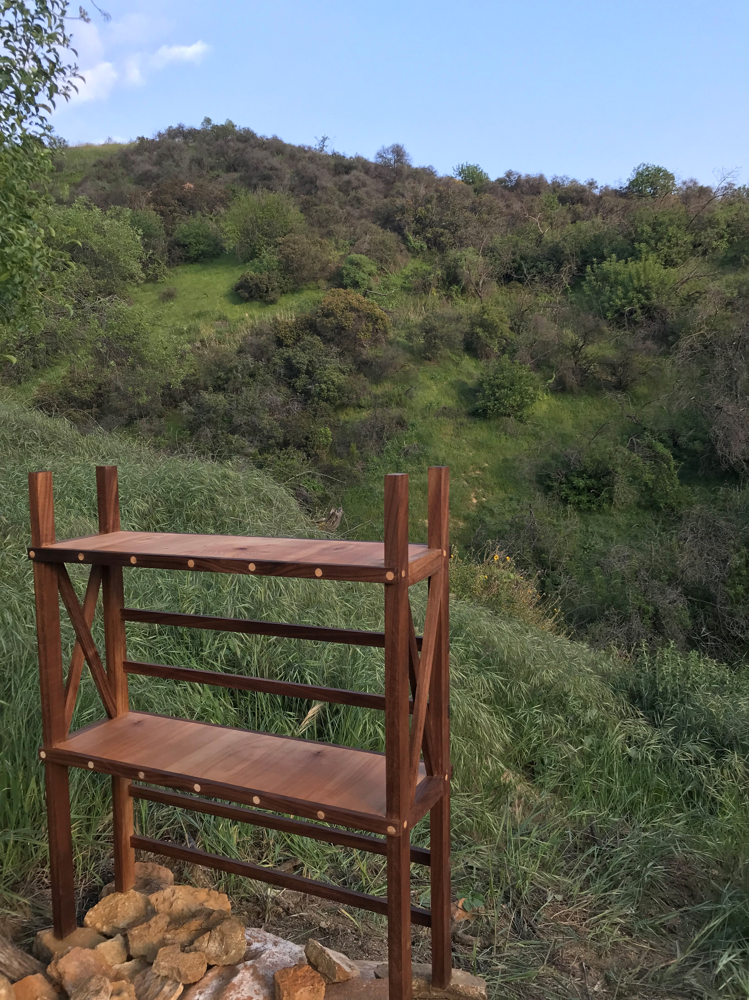

# Furniture
_________  

|  Furniture projects are much bigger than spoon or pen projects and as a result are fewer and further between. As with spoons and pens, I like to let the grain do the talking in my furniture. Allowing the grain to speak is the art.  |
|  :---:  |
|  [Return Home](index.md)  |
|  [My Favorite Piece of Furniture](#birch-sidetable)  |  

_________  

### Birch Sidetable

This birch sidetable is a lighthearted table meant to greet next to the door. With light woods and a slight shimmer, it welcomes. The top is a combination of birch and a maple centerpiece. The legs are redwood with a birch peg lined for support and connected to a birch core. Interested in the construction? [Table Construction](SideTableCreation.md)  (12/25/2019)

  

  

_________  

_________  

### Display Shelf

This shelf was created to effectively store my brother's books as we had to adapt our workspaces for homeschooling due to the coronavirus quarintine. This shelf, originally meant to be a quick utility project turned into one where I focused mainly on the asthetic value of the shelf. Using a technique I had learned from talking with a woodworker in Topanga, I created the facing of the shelf with inlaid maple dowels. This project also helped to use some spare would that has been lying around from other projects. (3/29/2020)  

Displayed on a ridge, the shelf remains orderly, square, and elegant with the chaotic growth of nature superimposed in the background.  

  

  

_________  

_________  
  

Miscellaneous projects where functionality is the goal: [MiscProjects](MiscellaneousItems.md)  

_________  

_________  

_________  

_________  

Thomas Matthew 2020