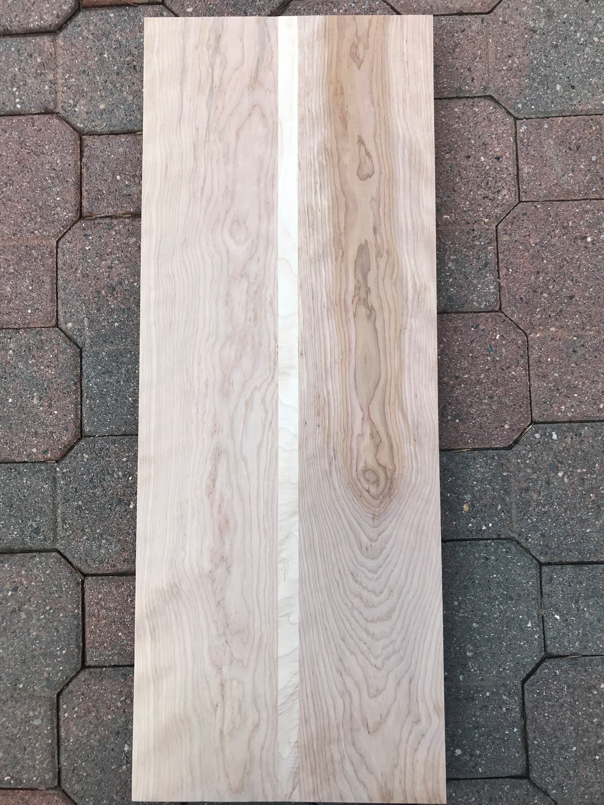
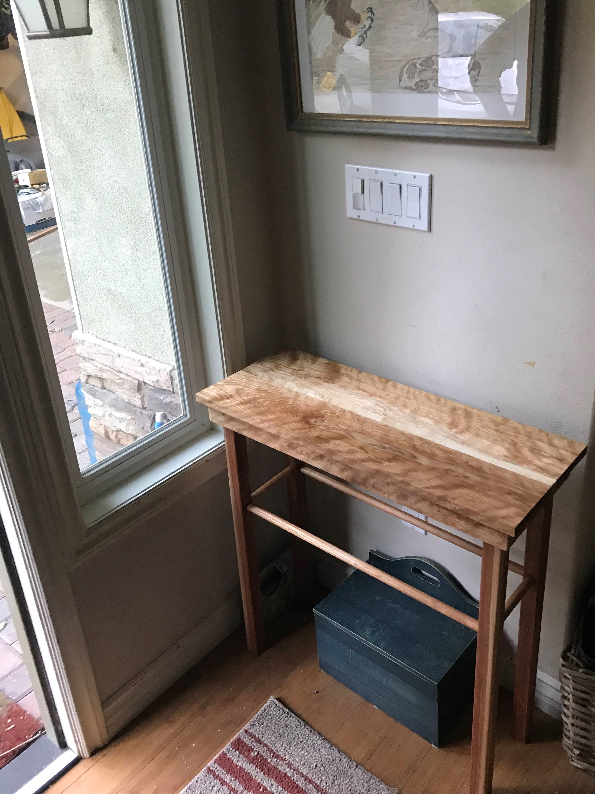

# Furniture
_________  

|  Furniture projects are much bigger than spoon or pen projects and as a result are fewer and further between. As with spoons and pens, I like to let the grain do the talking in my furniture. Allowing the grain to speak is the art.  |
|  :---:  |
|  [Return Home](index.md)  |
|  [My Favorite Piece of Furniture](#birch-sidetable)  |  

_________  

### Birch Sidetable

This birch sidetable is a lighthearted table meant to greet next to the door. With light woods and a slight shimmer, it welcomes. The top is a combination of birch and a maple centerpiece. The legs are redwood with a birch peg lined for support and connected to a birch core. Interesting in the construction? [Table Construction](SideTableCreation.md)  (12/25/2019)

  

  

_________  

_________  

Miscellaneous projects where functionality is the goal: [MiscProjects](MiscellaneousItems.md)  

_________  

_________  

_________  

_________  

Thomas Matthew 2019