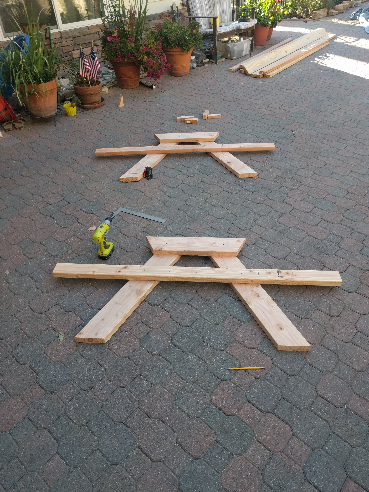
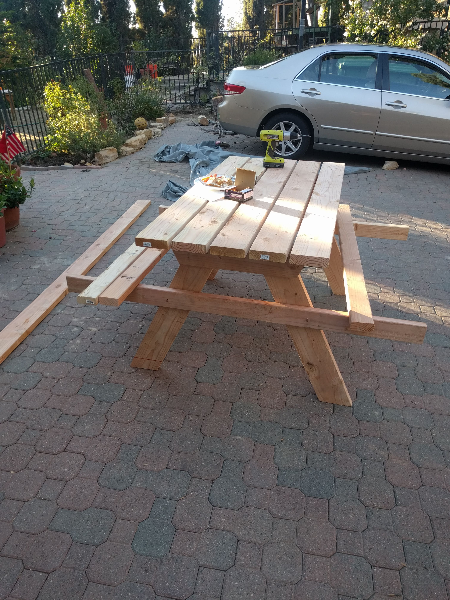
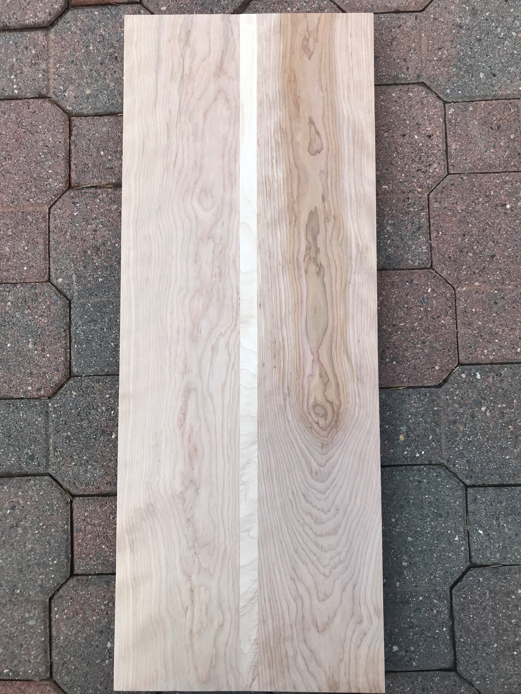
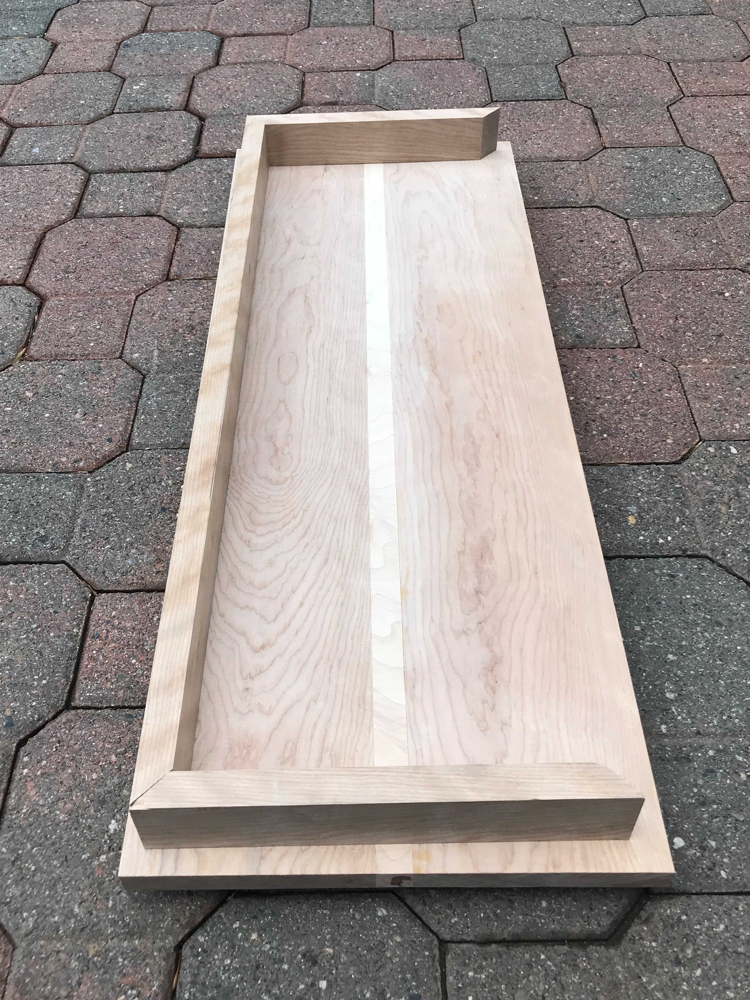
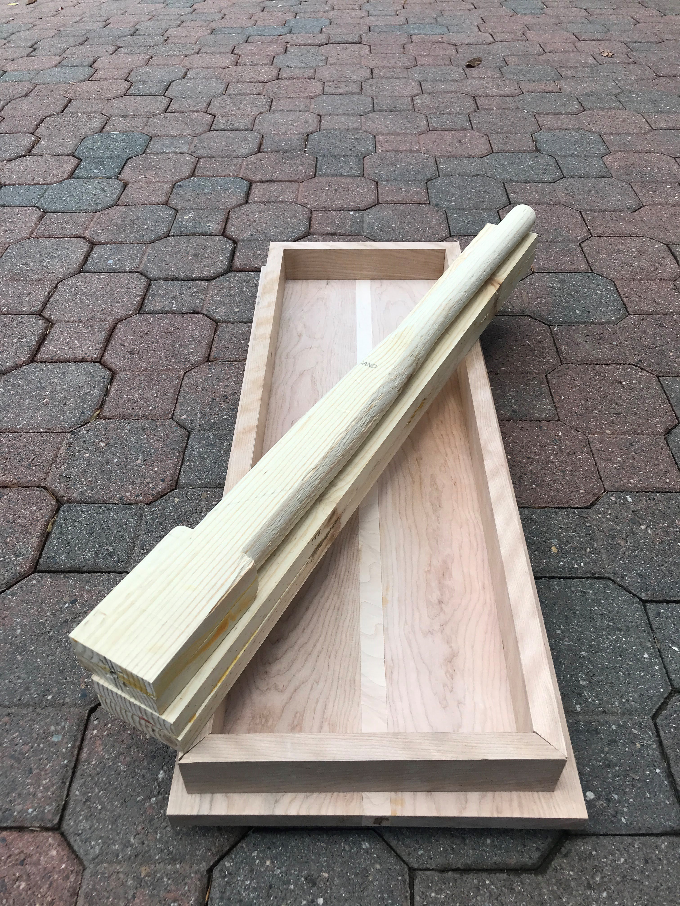
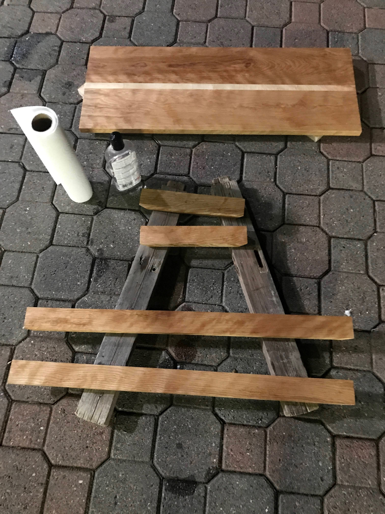

# Furniture

## Picnic Table

My mom wanted a  table modeled after the ones at Zuma Beach. They were the basic picnic table frame made from heavy 2x6s and 2x8s. When making this table I used 2x4s and 2x6s to save on weight and money. Most notably they were painted yellow. We found the perfect shade at Dunn Edwards and it glows to this day.  
  

Assembling frames of the table:

  
Here the tabletop and benchtops, which hold the frame together, are being screwing in:
  
  
    
## Birch Sidetable

Another mom commission. I slid into our old one and broke it.

The top is a combination of birch and a maple centerpiece cut with my new tablesaw. 

  
The table will be connected to the legs via this frame also made of finished birch.

  
The legs were turned out of pine planks glued together, this was to save on cost since we spent all our money on the finished birch.

  
This is what the tabletop looks finished with mineral oil.  

