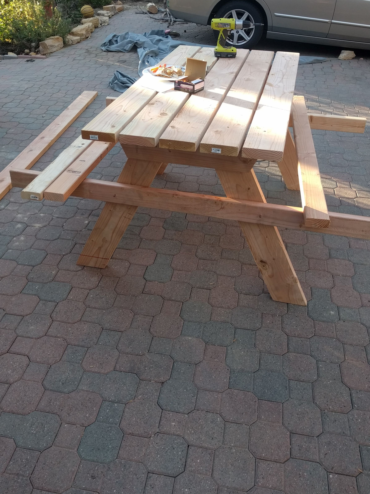

# Furniture

Furniture projects are much bigger than spoon or pen projects and as a result are fewer and further between. However, I have been building furnite much longer than I have been making pens and spoons but much of that content is not on this site.

[Return Home](index.md)

[My Favorite Piece of Furniture](#birch-sidetable)

## Birch Sidetable

I broke our old table. So I made a new one.

The top is a combination of birch and a maple centerpiece cut with my new tablesaw I got for my birthday. I also drew the picture of the eagle attacking the snake just peaking out in the photo above it. Very proud of that too.(12/25/2019)

  

  
The table will be connected to the legs via this frame also made of finished birch.

    
This is what the tabletop looks finished with mineral oil.  

Paper was used when glueing to prevent glue from wandering. If the paper was glued on to the wood, it could be easliy sanded away.
  
  
  

## Picnic Table

My mom wanted a  table modeled after the ones at Zuma Beach. They were the basic picnic table frame made from heavy 2x6s and 2x8s and painted bright yellow. When making this table I used 2x4s and 2x6s to save on weight and money. We found the perfect shade at Dunn Edwards and it glows to this day.(7/22/2018)
  

Assembling frames of the table:

  
Here the tabletop and benchtops, which hold the frame together, are being screwing in:
  
  

## Access Stairs
These stairs  are to access our hill where many plants are grown. We used to climb up the brick wall but it was starting to collaspe and I didn't want to knock down more dirt by climbing up the dirt. These stairs make getting on to the trail much easier.  
  
  They are bolted to a concrete foundation with lag bolts. If I do it over again, I would make the stairs wider but everything else turned out great.(2/5/2018)

## Hamster Table

A wooden table for utility, I made it out of pine. It looks ugly but it is super sturdy and functional. On top sits my brother's handmade hamster cage. Although I'm not fond of hamsters, I am fond of making tables for functionality rather than looks.(3/3/2019)

## Display Case
A display case made of scrap wood and a piece of plexi. All these bones were found on the hill along with the sand. I think the jaw and matching skull is a coyete's and the vertebrate likely a deer's. The skull, I'm not sure: could be a rabbit, really big gopher, or something else. (2/13/2018)

## Spice Racks

A simple project but getting the angle right to make it fit in the drawer was quite difficult. Unfortunately, I didn't have any paint.(4/7/2018)

## Foot-rest Cover

**I did not make the foot-rest**, but I did sew the cover. I think this is loosely related to furniture and it turned out great so here it is. (12/9/2018)

