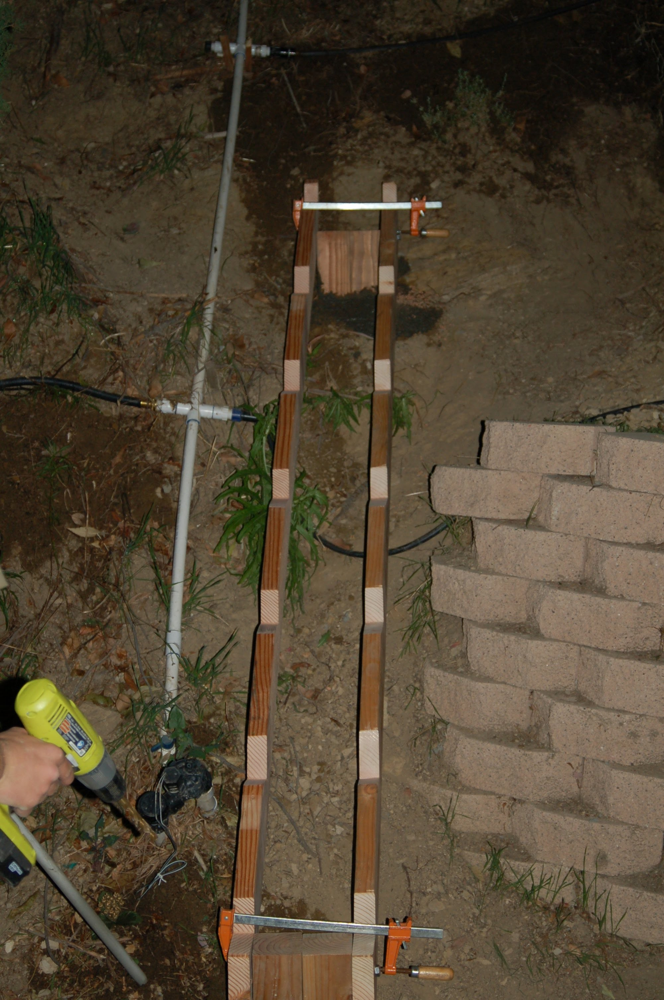
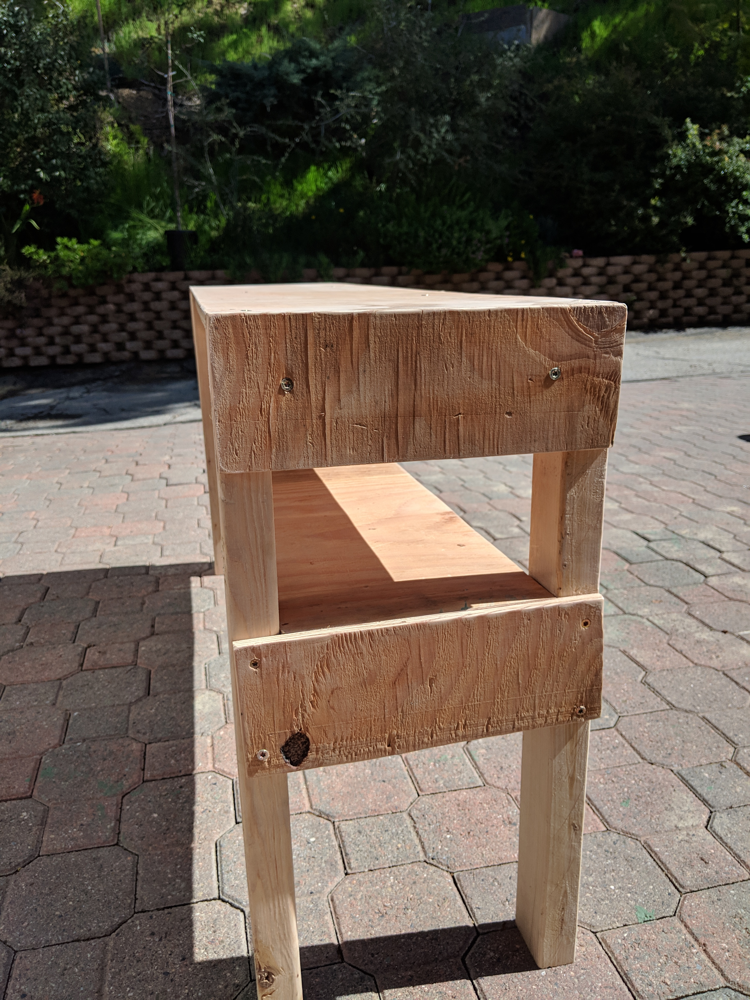
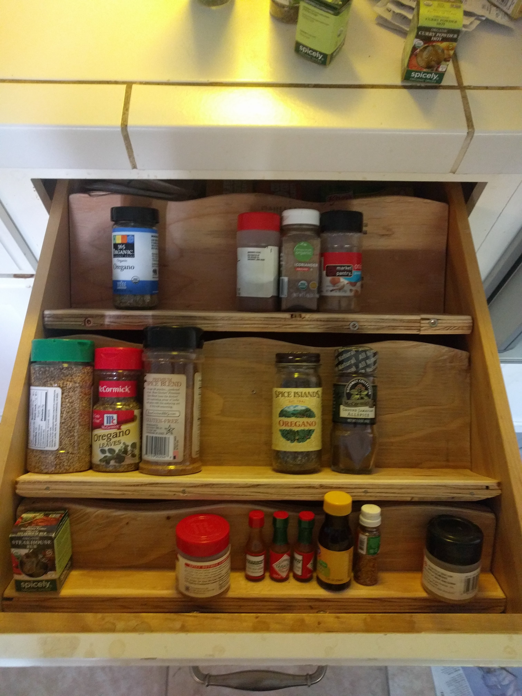
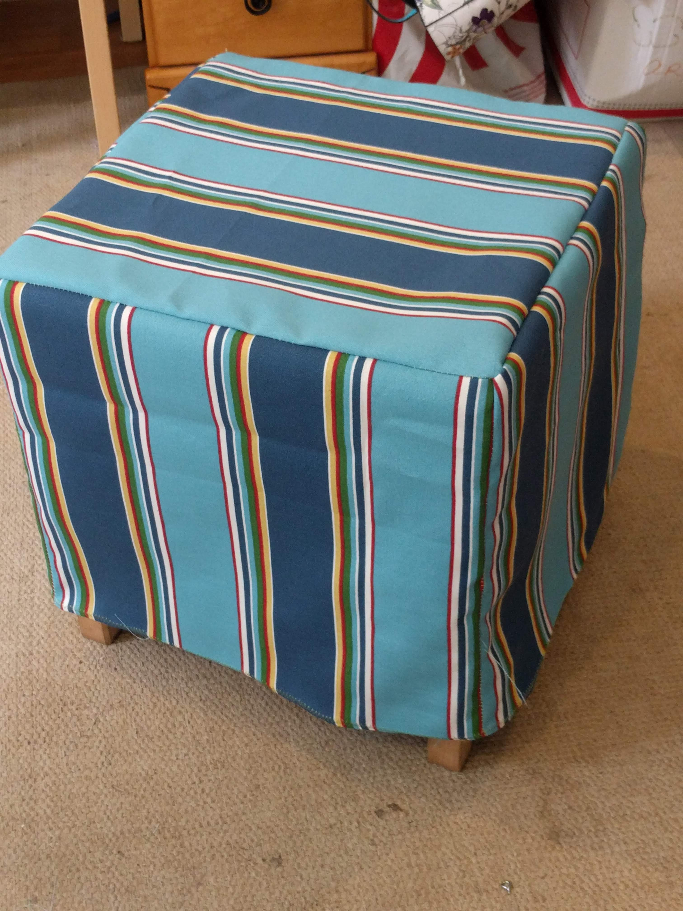

# Miscellaneous Items
***Function over Form***

_________  

|  [Return](Furniture.md)  |
|  :---:   |
|  [Return Home](index.md)  |

_________  

## Picnic Table

My mom wanted a  table modeled after the ones at Zuma Beach. They were the basic picnic table frame made from heavy 2x6s and 2x8s and painted bright yellow. When making this table I used 2x4s and 2x6s to save on weight and money. We found the perfect shade at Dunn Edwards and it glows to this day.(7/22/2018)
  

Assembling frames of the table:

  
Here the tabletop and benchtops, which hold the frame together, are being screwing in:
  
  
_________  

## Access Stairs
These stairs  are to access our hill where many plants are grown. We used to climb up the brick wall but it was starting to collaspe and I didn't want to knock down more dirt by climbing up the dirt. These stairs make getting on to the trail much easier.  
  
  They are bolted to a concrete foundation with lag bolts. If I do it over again, I would make the stairs wider but everything else turned out great.(2/5/2018)

  

The frame was cut from a 2x8 to hold the individual stairs:
  

Super Level!

_________  

## Hamster Table

A wooden table for utility, I made it out of pine. It looks ugly but it is super sturdy and functional. On top sits my brother's handmade hamster cage. Although I'm not fond of hamsters, I am fond of making tables for functionality rather than looks.(3/3/2019)

_________  

## Display Case
A display case made of scrap wood and a piece of plexi. All these bones were found on the hill along with the sand. I think the jaw and matching skull is a coyete's and the vertebrate likely a deer's. The skull, I'm not sure: could be a rabbit, really big gopher, or something else. (2/13/2018)

_________  

## Spice Racks

A simple project but getting the angle right to make it fit in the drawer was quite difficult. Unfortunately, I didn't have any paint at the time. Its ok though because the spices cover up the ugly plywood.(4/7/2018)

_________  

## Foot-rest Cover

**I did not make the foot-rest**, but I did sew the cover. I think this is loosely related to furniture and it turned out great so here it is. (12/9/2018)

_________  

_________  

_________  

_________  

Thomas Matthew 2018