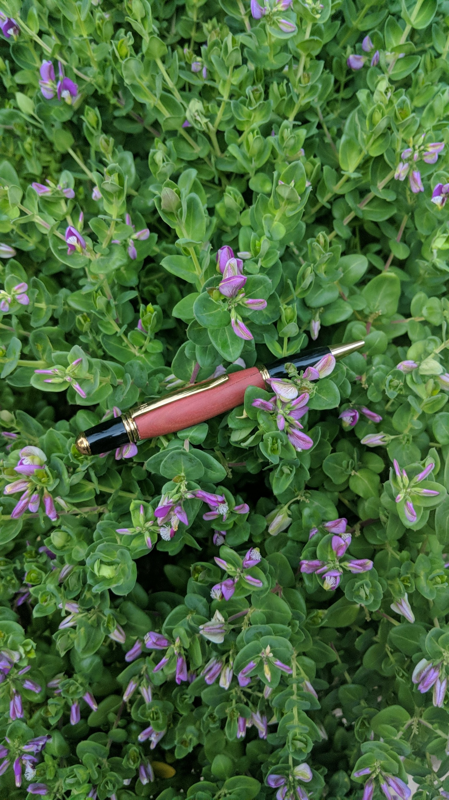
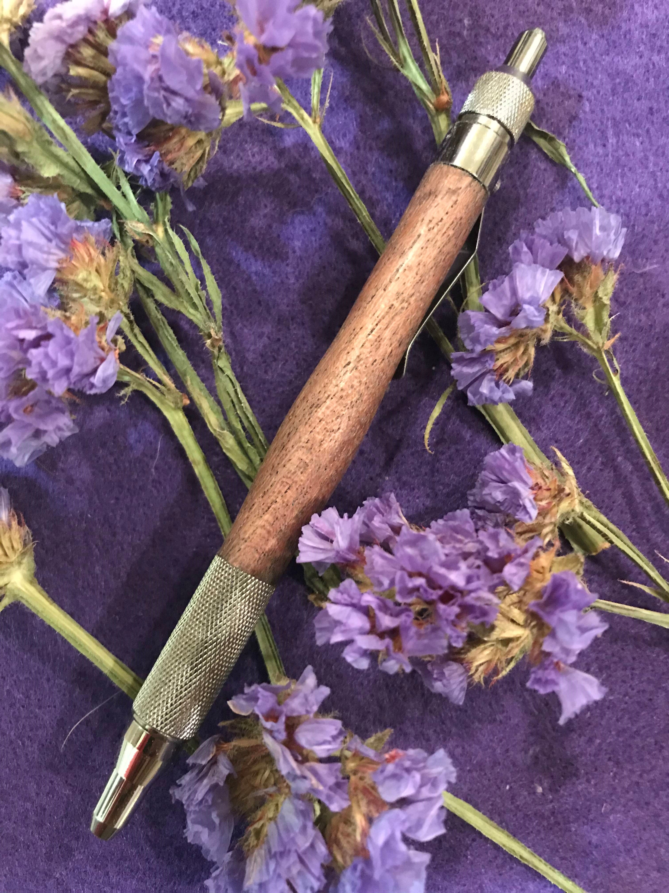
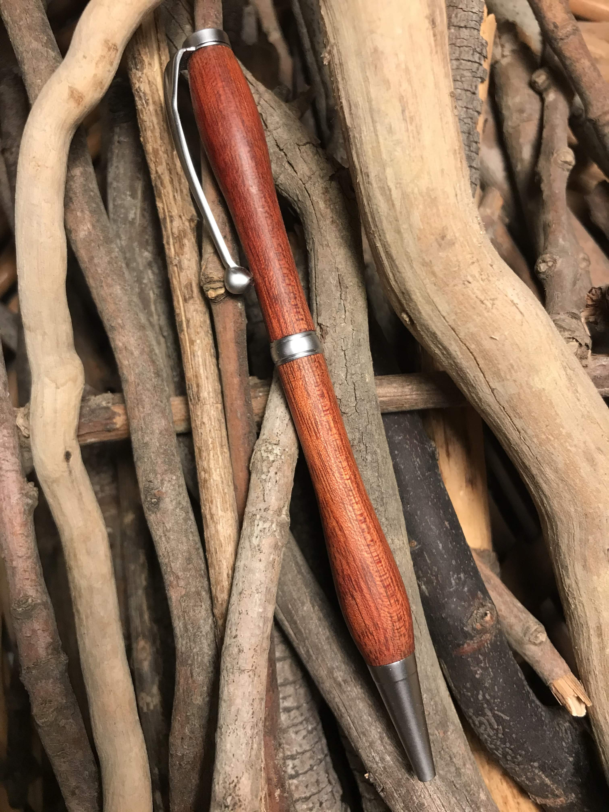
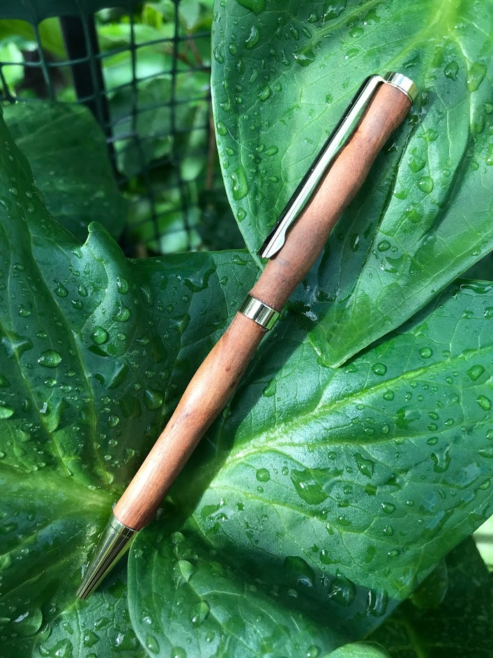
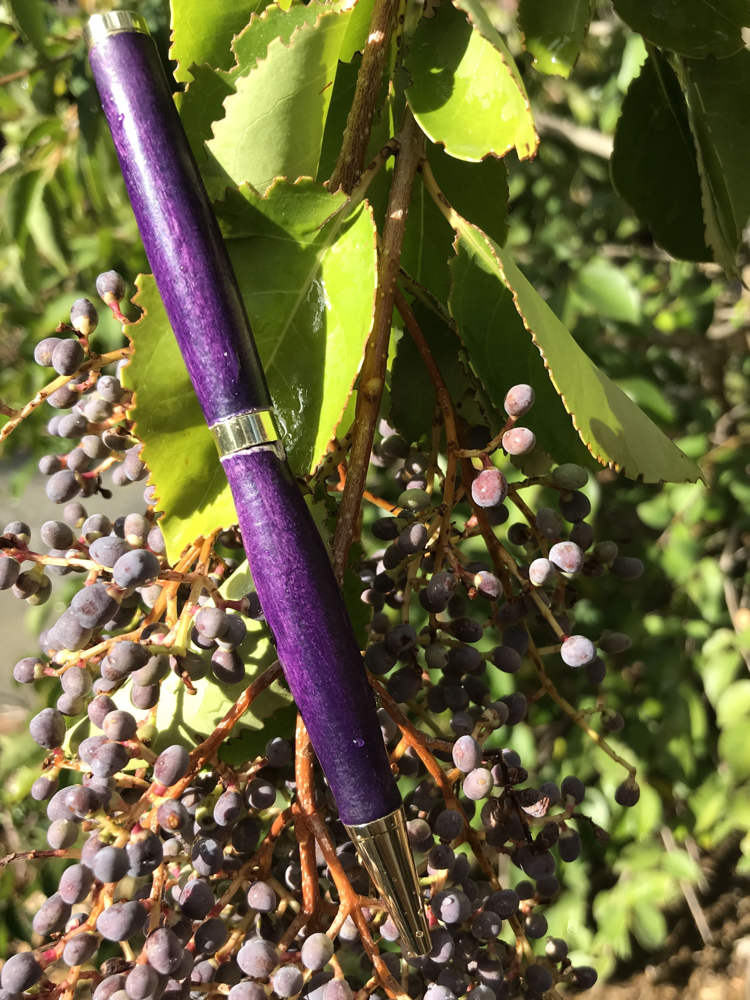
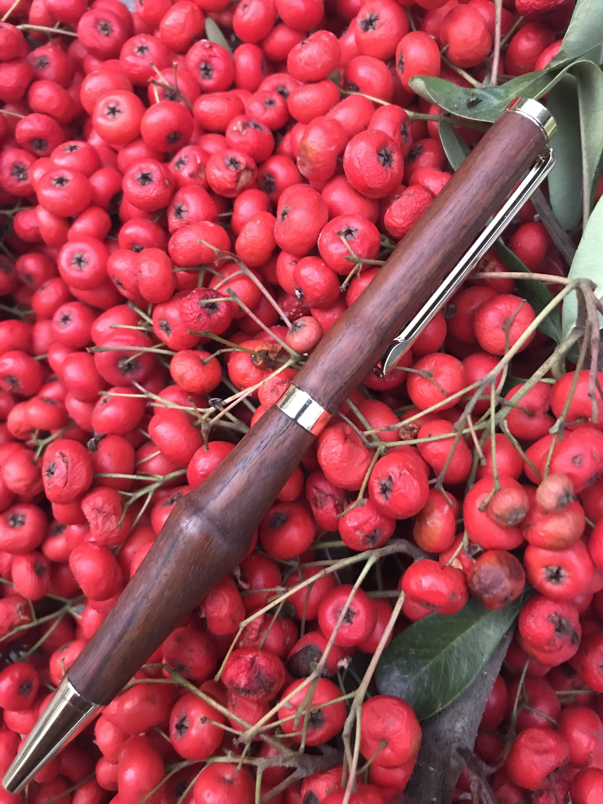

# Pens

Pens are created using pen kits bought from various suppliers.  
Unlike spoons, I make pens using both purchased wood blanks as well as wood from home due to the importance of the hardness and density of the wood. The wood is turned very thin and precisely so blanks must be of the highest quality. 

The pens are denoted (wood type) then (pen kit type).

[Return Home](index.md)

### Redheart Gatsby 

Crafted from beautiful redheart wood sourced from South America, this pen has a simple but functional design for use in the classroom. The gatsby kit is stout and well balanced making it the perfect writing tool. 

### Bocate Cuban  

Turned out of bocate wood which has a increditable grain pattern. Taking my knowledge from the

[redheart gatsby pen](#redheart-gatsby-pen), I put a little more style into this pen while still letting the grain be the main focus. This pen is larger and heavier than the redheart but still has a nice balance in the hand.

### Bolivian Coffeewood Cat Themed 

I made this pen for one of my chemistry teachers. She loves cats so I chose this kit combined with the Bolivian Coffeewood. I chose that wood because I thought it looked the most cat-like out of what I had. I think it looks like a tabby.

### Eucalyptus Cuban 

I decided to try something different and make the orange hue of eucalyptus core match the copper plating on this pen kit. Eucalyptus wood isn't very hard or dense (which is very important when making pens because the layer of wood is so thin and can easily crack) so I ran into a few problems but in the end it came together. It was well worth it.

### Bolivian Coffeewood EDC

This is an every-day-carry pen (EDC) for use in the classroom. It is a click pen with a modified ink cartriage for better writing. The wood design is slim to fit well in the hand.

### Bloodwood Slimline 

I modeled this pen after the symbol for infinity. I wanted it to be as symmetrical as possibe and I am happy with the results considering I didn't use a jig or calipers to expedite the process. This is the first of many slimlines I plan to make and then sell. Their kit is very inexpensive and quickly made making it ideal for mass production. 

### Wenge Gatsby 

 

The Gatsby pen model is still my favorite for its superior balance and style. Experimenting with a new coating technique using glue instead of wood oil caused this pen to look like it is coating in glass. This is also the first of many pens that will be made with a new set of exotic woods I bought for pen making. Wenge is from Central Africa and is an endangered species. However, this piece was sourced responsibly.

### Walnut Slimline 

My new favorite pen, the unorthodox shape I tried on this one had great results in my opinion. It is very comfortable to hold and has a unique feel. The rich color of the walnut is brought out by the sweeping curves of the shape. This pen, along with the following 4 slimlines, were all made in quick succession to test the viability of an makeshift assembly line for mass producing sellable pens. (11/27/2019)

### Pepperwood Slimline 

One of the few woods at our house that can hold the difficult pose of being a pen, Pepperwood has a great color that matches well with the gold of the pen kit. I tried to make this pen increditable thin which risks the wood cracking but feels great in the hand when writing. It was successful and I added subtle waves for style on the upper tube.(11/27/2019)

### Mystery Wood Slimline

This piece was in the inventory but I have no idea where this wood came from. I need to improve my wood accounting skills I guess. Although theories exist for its type, I am not confident enough to say one way or the other. It made a good looking pen though. There were some issues with the wood getting dirty from lubricant that seeped out of the pen mandrel threads. I fixed this by cleaning the mandrel and removing the outter layer of wood that was stained. Light colored, pourous woods like these have had a tendancy to soak up sawdust, lubricant, and other impurities that ruin the color. A comprehensive solution is in the works. (11/27/2019)

### Purple-Painted Slimline

This pen was an experiment with some scrap wood that actually turned out nice. It was only roughly sanded before painting to prevent it from having a completely uniform, unnatural look. The roughness gives a fabric like appearance in my opinion. Unlike other pens, it is sealed with glue (rather than wood oil and wax).(11/27/2019)

### Ipe Slimline

Second favorite from this batch, the Ipe wood looks great on this pen kit. The shape is simple but bold for this pen and assists in grip.(11/27/2019)

### African Padauk Executive

This wood has amazing color but long thin tunnels inside I presume carried water. These tunnels caused problems with the surface of the pen when finishing. The solution was a thin coating of CA glue, not pressed on, gently brushed across the surface. It filled in the holes nicely but left a strange texture from the napkin I used to brush it on. Although difficult to notice, I will have to use something super smooth next time I use this technique. Otherwise, I think this is the best pen I have made yet. The design is bold to match the color and glue coating gives a glasslike shine to the surface. (12/1/2019)
