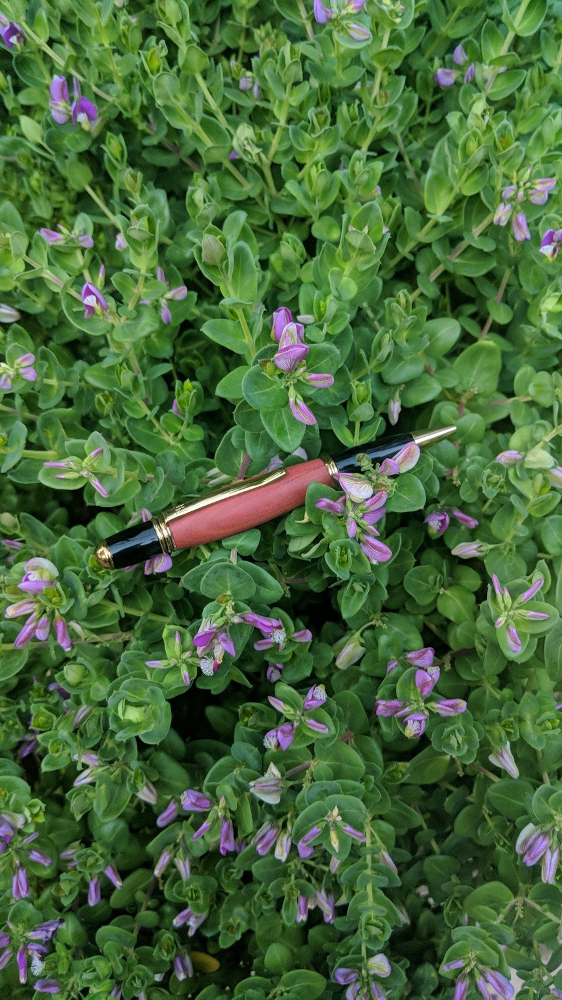
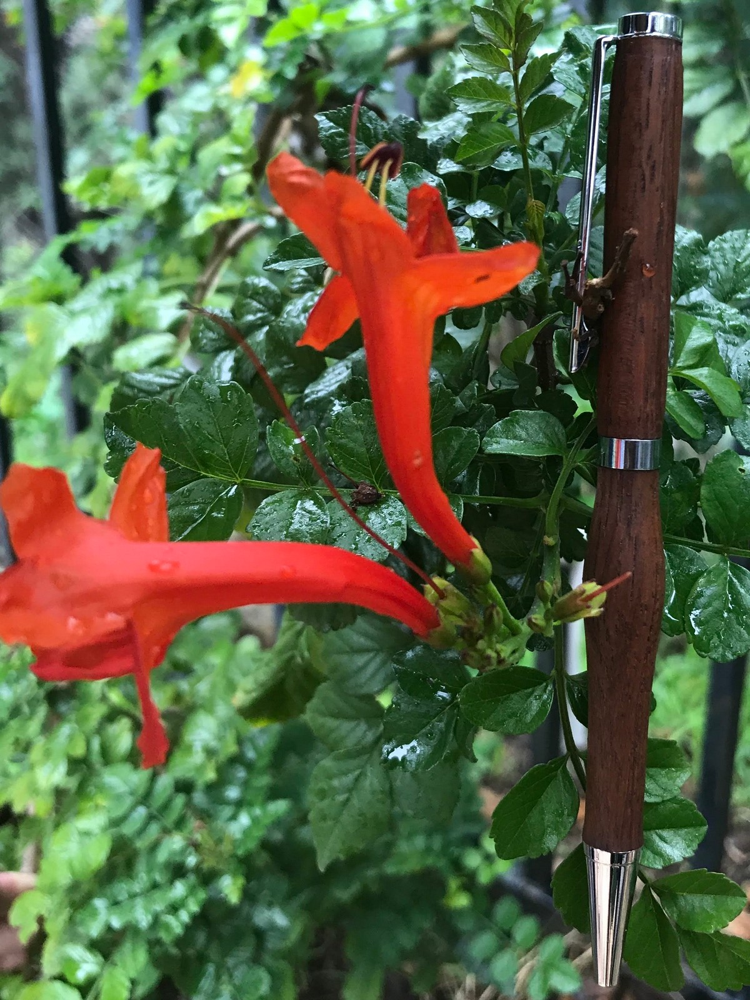
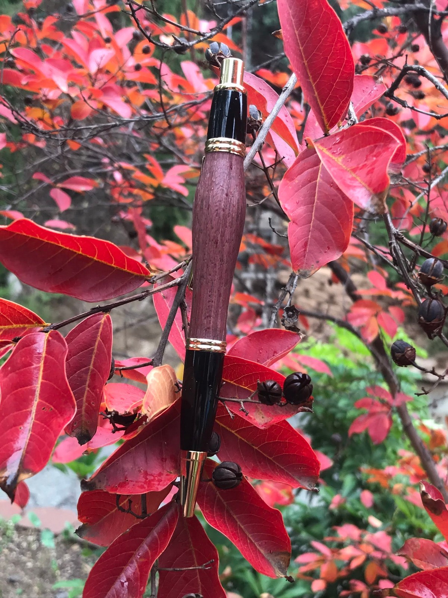

# Pens

_________  

|  Pens are created using pen kits that provide the metal pieces on each pen. Sustainably sourced exotic hardwoods of the highest quality are used and each pen is completely unique. Pens are denoted (wood type) (pen kit type).  |
|  :---:  |
|  [Return Home](index.md)  |
|  [My Favorite Pen](#bocote-executive)  |

_________  

### Redheart Gatsby 

Crafted from beautiful redheart wood sourced from South America, this pen has a simple but functional design for use in the classroom. The gatsby kit is stout and well balanced making it the perfect writing tool.

_________  

### Bocate Cuban  

Turned out of bocate wood which has a increditable grain pattern. Taking my knowledge from the Redheart Gatsby Pen, I put a little more style into this pen while still letting the grain be the main focus. This pen is larger and heavier than the redheart but still has a nice balance in the hand.

_________  

### Bolivian Coffeewood Cat Themed 

I made this pen for one of my chemistry teachers. She loves cats so I chose this kit combined with the Bolivian Coffeewood. I chose that wood because I thought it looked the most cat-like out of what I had. I think it looks like a tabby.

_________  

### Eucalyptus Cuban 

I decided to try something different and make the orange hue of eucalyptus core match the copper plating on this pen kit. Eucalyptus wood isn't very hard or dense (which is very important when making pens because the layer of wood is so thin and can easily crack) so I ran into a few problems but in the end it came together. It was well worth it.

_________  

### Bloodwood Slimline 

I modeled this pen after the symbol for infinity. I wanted it to be as symmetrical as possibe and I am happy with the results considering I didn't use a jig or calipers to expedite the process. This is the first of many slimlines I plan to make and then sell. Their kit is very inexpensive and quickly made making it ideal for mass production. 

_________  

### Wenge Gatsby 

 
ID: 19  

The Gatsby pen model is still my favorite for its superior balance and style. Experimenting with a new coating technique using glue instead of wood oil caused this pen to look like it is coating in glass. This is also the first of many pens that will be made with a new set of exotic woods I bought for pen making. Wenge is from Central Africa and is an endangered species. However, this piece was sourced responsibly with care taken to preserve the existing population of trees.

_________  

### Walnut Slimline 

  

ID: 18  

My new favorite pen, the unorthodox shape I tried on this one had great results in my opinion. It is very comfortable to hold and has a unique feel. The rich color of the walnut is brought out by the sweeping curves of the shape. This pen, along with the following 4 slimlines, were all made in quick succession to test the viability of an makeshift assembly line for mass producing sellable pens. (11/27/2019)

_________  

### Pepperwood Slimline 

One of the few woods at our house that can hold the difficult pose of being a pen, Pepperwood has a great color that matches well with the gold of the pen kit. I tried to make this pen increditable thin which risks the wood cracking but feels great in the hand when writing. It was successful and I added subtle waves for style on the upper tube.(11/27/2019)

_________  

### Mystery Wood Slimline

ID: 18  

This piece was in the inventory but I have no idea where this wood came from. I need to improve my wood accounting skills I guess. Although theories exist for its type, I am not confident enough to say one way or the other. It made a good looking pen though. There were some issues with the wood getting dirty from lubricant that seeped out of the pen mandrel threads. I fixed this by cleaning the mandrel and removing the outter layer of wood that was stained. Light colored, pourous woods like these have had a tendancy to soak up sawdust, lubricant, and other impurities that ruin the color. A comprehensive solution is in the works. (11/27/2019)

_________  

### Purple-Painted Slimline

This pen was an experiment with some scrap wood that actually turned out nice. It was only roughly sanded before painting to prevent it from having a completely uniform, unnatural look. The roughness gives a fabric like appearance in my opinion. Unlike other pens, it is sealed with glue (rather than wood oil and wax).(11/27/2019)

_________  

### Ipe Slimline

Second favorite from this batch, the Ipe wood looks great on this pen kit. The shape is simple but bold for this pen and assists in grip.(11/27/2019)
_________  

### African Padauk Executive

This wood has amazing color but long thin tunnels inside I presume carried water. These tunnels caused problems with the surface of the pen when finishing. The solution was a thin coating of CA glue, not pressed on, gently brushed across the surface. It filled in the holes nicely but left a strange texture from the napkin I used to brush it on. Although difficult to notice, I will have to use something super smooth next time I use this technique. Otherwise, I think this is the best pen I have made yet. The design is bold to match the color and glue coating gives a glasslike shine to the surface. (12/1/2019)

_________  

### Bolivian Rosewood Slimline

ID: 20  

Slimlines aren't my favorite as I like a thicker pen. This one turned out great though and really highlights the beauty of the rosewood.(12/7/2019)

_________  

### Purpleheart Gatsby (Click)

ID: 21  

*Displayed on a crepe myrtle planted for my brother*

Another highly successful project, this was the first click pen I have made. I like the click mechanism more than the twist, although it tends to rattle around when clicked down. The solution for that is to make the end cap have a tighter fit on the pen. The curve on this pen goes down before it comes back up. This is risky as you might run out of wood on the way down (and hit the brass tubing underneath that contains the pen mechanism). However, for this pen it worked great to give the pen a comfortable writing hold and beautiful shape. (12/7/2019)

_________  

_________  

_________  

| *-------------* *Fall 2019 Set* *-------------* |
|            :---:             |
|     |
  
  
### Bocote Executive

ID: 22  

My new favorite pen!(again) Unlike my first bocote, I did not wet sand this one. This meant that the lighter, more porous section of the wood didn't absorb the dark sanded away material and become darker. This perserved the stark contrast between grain lines natural to bocote wood. I wanted a bold contrast between the grain colors because of the beautiful pattern derived the 2 subtle high points at the ends of the pen. I perfected my sanding/polishing technique without using water on this pen. This technique is extremely valuable in the future when working with lighter colored wood.(12/15/2019)

_________  

### Gongolo Alves Executive

ID: 23  

*Displayed on a bird of paradise leaf tempered with a California winter*

The grain pattern of this wood is my favorite over bocote, paduak, or wenge. The way it blends light and dark colored wood fibers gives amazing patterns. For this one, I took care to set the ridge where my hand would rest when writing. The ridge, aside from being ergonomic, is meant to highlight the beautiful grain and give the pen a sleek look with the 'sharp' edge. I'd like to point out the diamond shape created by the contour of the ridge as a defining feature that makes this pen great. (12/15/2019)

_________  

### Cocobolo Executive

ID: 24  

The most modest of the set, this pen was coated in CA glue which was then sanded off. After lacquer and wax, the pores in the wood that were filled in previously by the CA glue shimmer in the light. This effect is especially striking against the deep, dark color of the cocobolo. This is my new technique of choice for woods with deep pores that can't be sanded away. It fills them in without sacrificing the great natural texture of the wood with a full CA coating.(12/15/2019)

 _________  
 
   
| *-------------* *Set Finished* *-------------* |
|      :---:      |
|      |

 _________  

_________  

_________  

### Leopardwood Gatsby

  

ID: 25  

A truely beautiful and exotic pen. This pen was created to dazzle which is why I used the leopardwood. Here again, the shape of the pen was to best display the grain. Without the strange shape, the circlar patterns at each ridge wouldn't appear. Despite the interesting shape, I quite like how the pen feels writing.(12/16/2019)

_________  

### Yellowheart Gatsby Click

  
ID: 26  

*Displayed on a yellowing walnut tree nested in a fold of our valley in the winter months.*

My favorite color is yellow so I like this pen. However, the wood tends to look fake at times because its color is so unbelieveable. A yellow pen is much less dazzling than a wood pen that is yellow colored in my opinion. To get the darker sanded material out of all the pores of this pen(because it is yellow this material stood out) I buffed it throughoutly while varnishing with mineral oil. This worked well to push any dark impurities out of the pores of the wood.(12/29/2019)  

### East Indian Rosewood Classic 

  
ID: 27  

My first endeavor in fountain pens. I realized that the design needed to look good with the cap off or on, when writing or not. The rosewood is dark and heavy with a deep grain. Its contrast with the silver pen nib creates an elegant feel. (1/19/2020)  

### African Blackwood Olympian

  
ID: 28  

This kit was expensive because it contains a quality nib and wide barrels. The wideness of the pen fits comfortably in the hand. Additionally, the blackwood is increditably dense but the weight around the pen is well balanced. This gives a feel of confidence when writing. Another result of the wood density is the ability to polish to a great sheen. (1/19/2020)  

### Canarywood Trimline

  
ID: 29  

*Displayed on a schefflera*

This pen's design is minimalist. Before I started, I noticed a abnormality in the blank, a red streak. I drilled so that its predicted path would be displayed in the finished product. This line adds a touch of uniqueness to a gentle pen. Besides this, I used a technique I learned when making the [Bocote Executive](###Bocote-Executive) to clean the pours of the wood. This is especially important in light woods like this one. (1/19/2020)  

### Cocobolo Slimline Silver  

  
ID: 30  

A modern pen made to write and sign with style. This cocobolo blank was positioned so that a brighter orange flair appeared right at the tip of the pen and the end. Additionally, there is a beautiful variation of color along the length of the pen that compliments the style. (2/3/2020)

### Shedua Designer

  
ID: 31  

*Displayed on a daisy bush blooming a little early in season*

Made of a softer wood that displays a deep grain of many strands. The tree it is derived from is more formally known as Guibourtia ehie, a rare tree from central Africa. The designer kit does well to let the wood speak for itself while providing a elegant background that fits well in the hand. The gold of the kit well compliments the warmness of the shedua wood. (2/3/2020)

### Teak Designer 

  
ID: 32  

*Displayed on a hanging eucalyptus branch with silver dollar leaves*

This pen displays smooth curves with a subtle wood that displays class in a modest way. Teak wood comes from a large tree that is quite common and well used for its high quality. It is a good balance between strength and wieght, being robust while still resting gently in the hand. With a ergonomic design, this pen writes smoothly and comfortably for long periods. Perfect for the regular writer. (2/3/2020)    

### Katalox Trimline 

  
ID: 33  

*Displayed on an mysterious indigenous plant that blooms briefly while appearing dead the rest of the year*

This pen was crafted from deep purple katalox wood that has an incredible density. This means it is able to be sanded to a perfect surface, smooth as stone. One of my new favorites, this pen is top tier when it comes to elegant and craft. Its simple design contains carefully measured curves to fit best in the average hand and to be mathematically pleasing to the eye. (2/3/2020)  

[Return To Top](#Pens)

_________  

_________  

_________  

_________  

Thomas Matthew 2020
