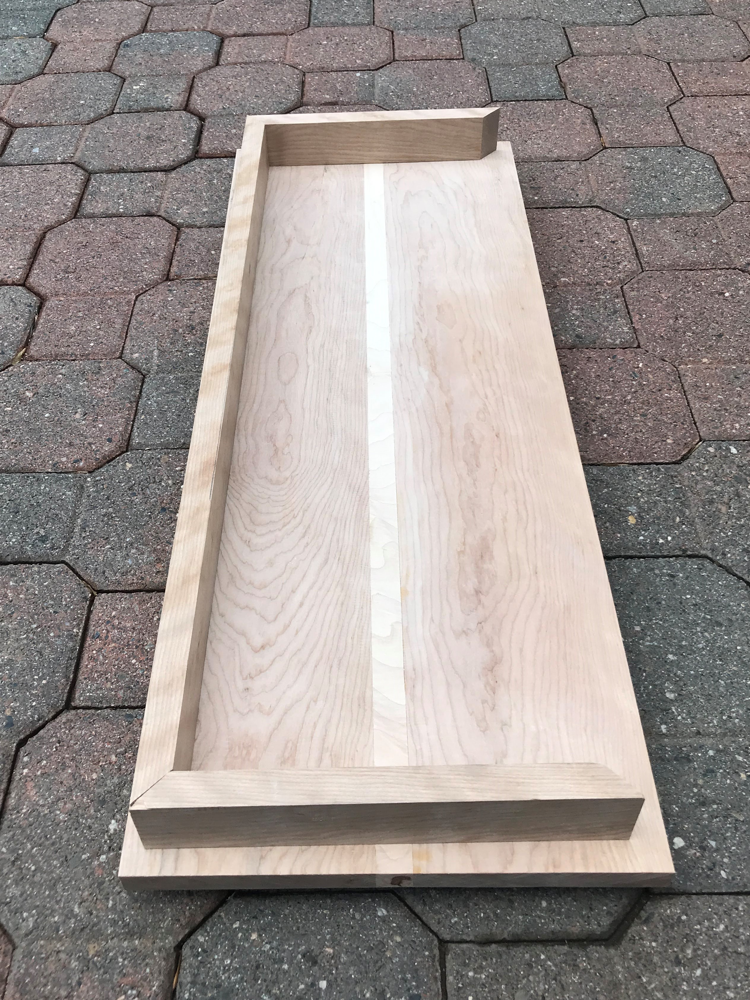
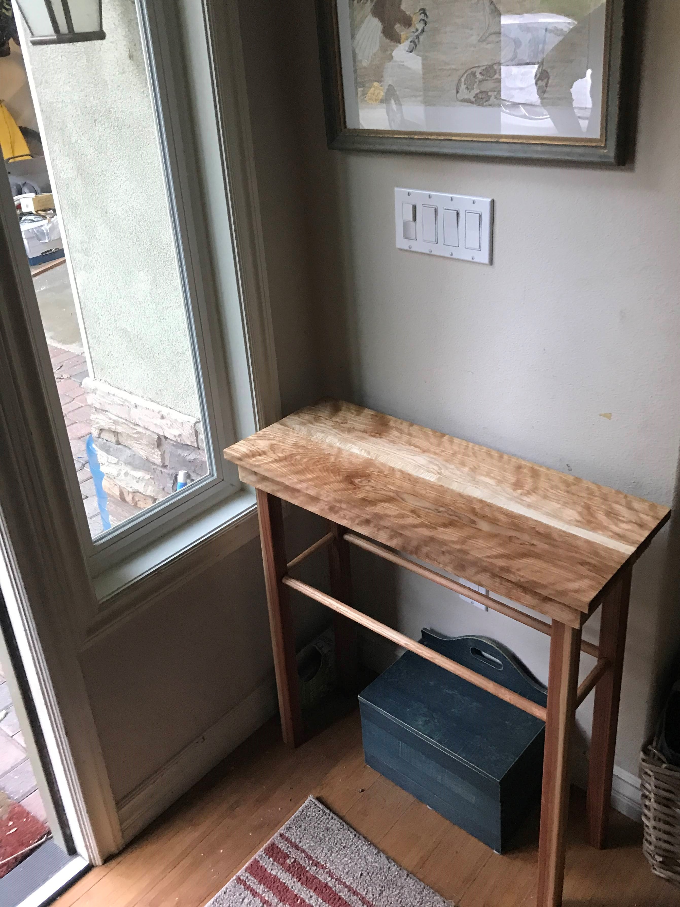

# Birch Sidetable: Construction

_________  

|  [Return](Furniture.md)  |
|  :---:  |
|  [Return Home](index.md)  |

_________  

Detailed photos showing steps to the construction of this table:

_________  

The unsanded and unlacored tabletop after merging 2 parts birch, 1 part maple:

The table will be connected to the legs via this frame also made of finished birch.

    
This is what the tabletop looks finished with mineral oil.  

Paper was used when glueing to prevent glue from wandering. If the paper was glued on to the wood, it could be easliy sanded away.  
 Glueing the base together using a square block to ancor the clamps to:
  

Glueing in the legs and dowl struts simultanously:
  

The legs and struts are completely glued to the base. The paper will be removed by scraping and sanding:
  

The finished product. 4 Screws were used to further anchor the legs to the base. The tabletop was glued to the legs, base combination.
  

Here is the sidetable in place:
  

_________  

_________  

_________  

_________  

Thomas Matthew 2019