# Spoons

_________  

|  Handcrafted using a lathe, carving, and a lot of sanding. Wood used for spoons is all locally sourced. To see the general steps behind the spoons check out: [Spoon Creation](SpoonCreation.md).  |
|  :---:  |
|  [Return Home](index.md)  |
|  [My Favorite Spoon](#cypress-spoon)  |  

__________  

## Finished Spoons

Here is a sampling of some of my best spoons. 

*All grain patterns and coloring are completely natural, no dye is used in this process.*

### Pepperwood Spoon  

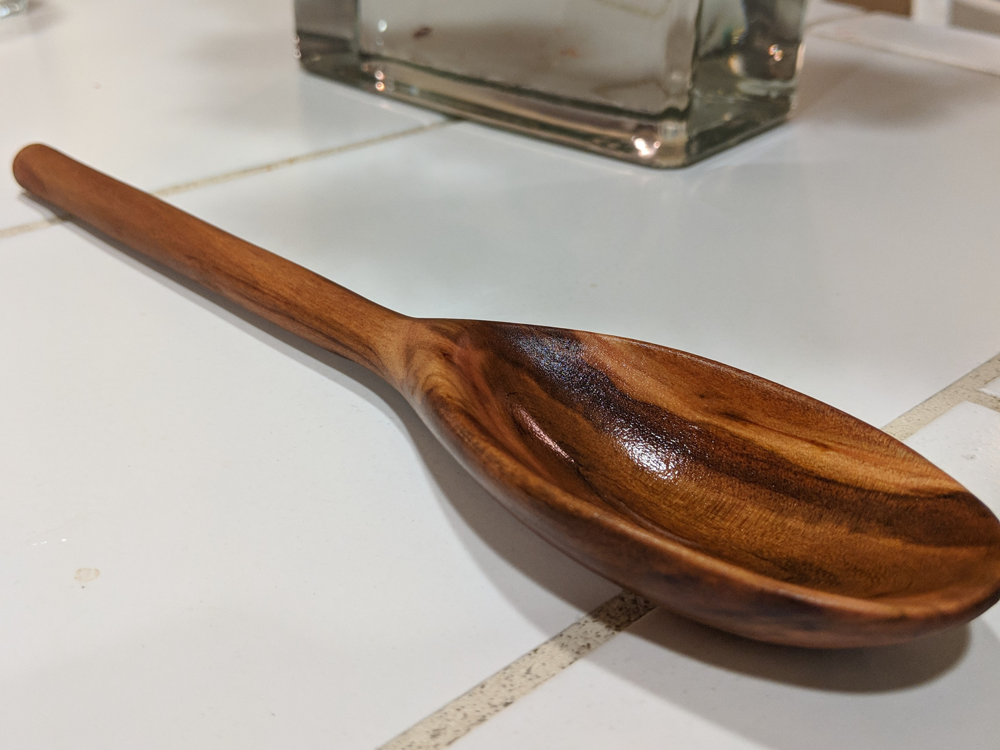  

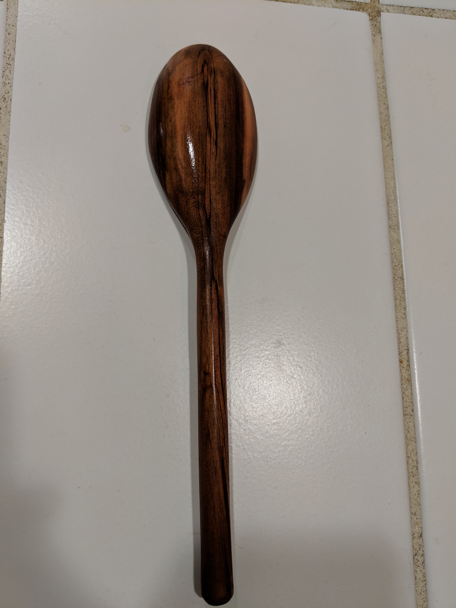  

This spoon was given as a gift to a very good friend of mine on her birthday. This was my first spoon that I was really proud to show off for the craftsmanship. It is best used making pasta.(12/4/2018)  

__________  

### Magnolia Spoon
  

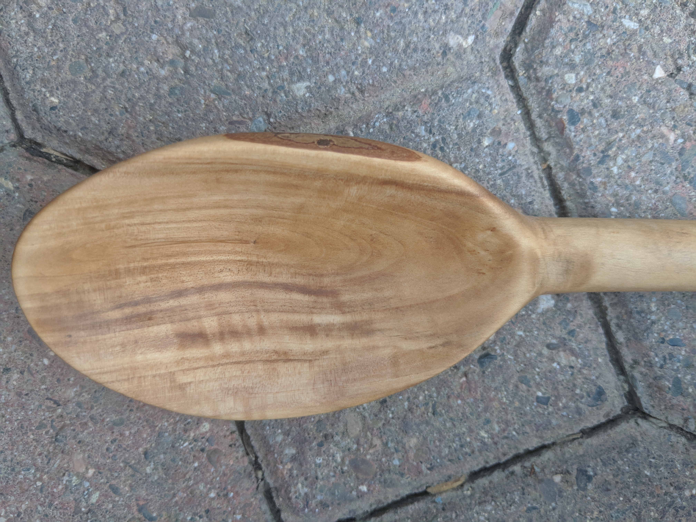  

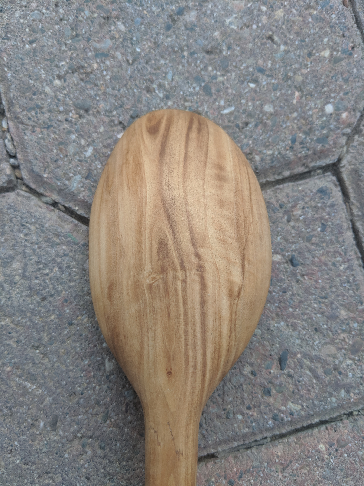  

This scrap magnolia piece revealed a beautiful grain. The spoon is bent at the connection between the scoop and the handle. Notice the tiny cracks that formed when bending. I believe this is because I didn't heat up the fibers of the wood as much as needed. There is a slight delay when I take the spoon out of the heater and to the vice. I believe this allows the fibers to cool enough so that they aren't as mobile as I want them to be. Additionally, this spoon has a loop at the end, which functions aesthetically and for ease of storage. The exposed bark on the side of the scoop is not a mistake but meant to remind the viewer the origin of the material. In a current state so foreign from a log, it is very easy to forget.  

__________  

### Spoon - Unknown Wood  

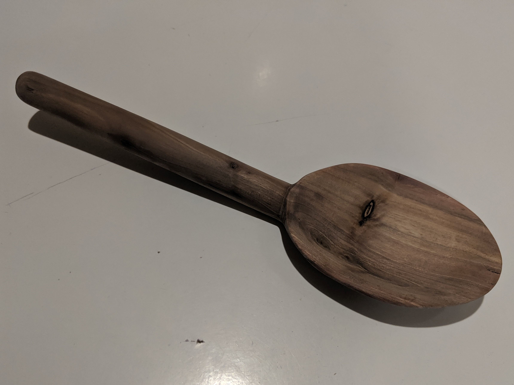  

Turned from a quality piece of wood lying around, this spoon is slightly bent where the handle meets the scoop. Possibly due to the wood's inherent hardness, this spoon is sanded very smooth. I don't know the origin of this wood. Short, with a wide, bent scoop this spoon is ideal as a eating utensil, not a cooking one like many of the others.  

__________  

### Mother's Day Present
### Cypress Spoon

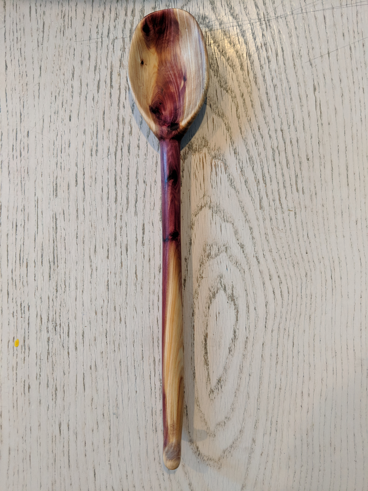  

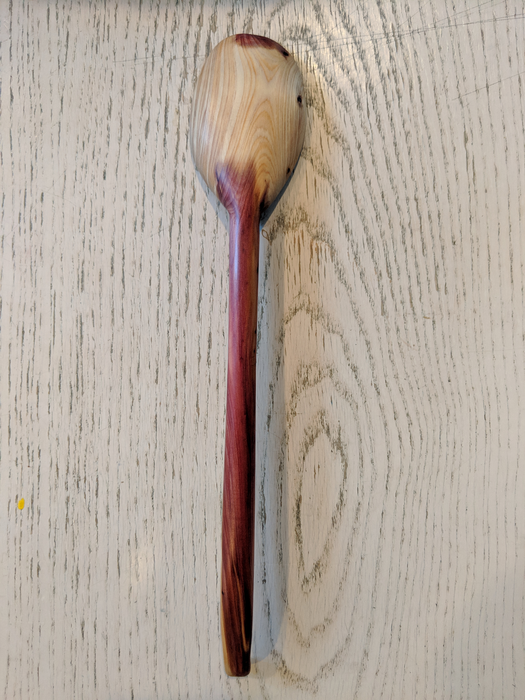  

This spoon is made from an old dead cypress that Mother planted that was taken from a seed of a tree my grandparents planted. I wanted to give her a spoon that captured something special to her. I also wanted to show my appreciation with a present she could use and one that would make her happy everytime she looked at it. The grain turned out to be the most beautiful out of any of the spoons I have made, displaying a fiery purple core that winds throughout the spoon.  

__________  

### White Alder Spoon 

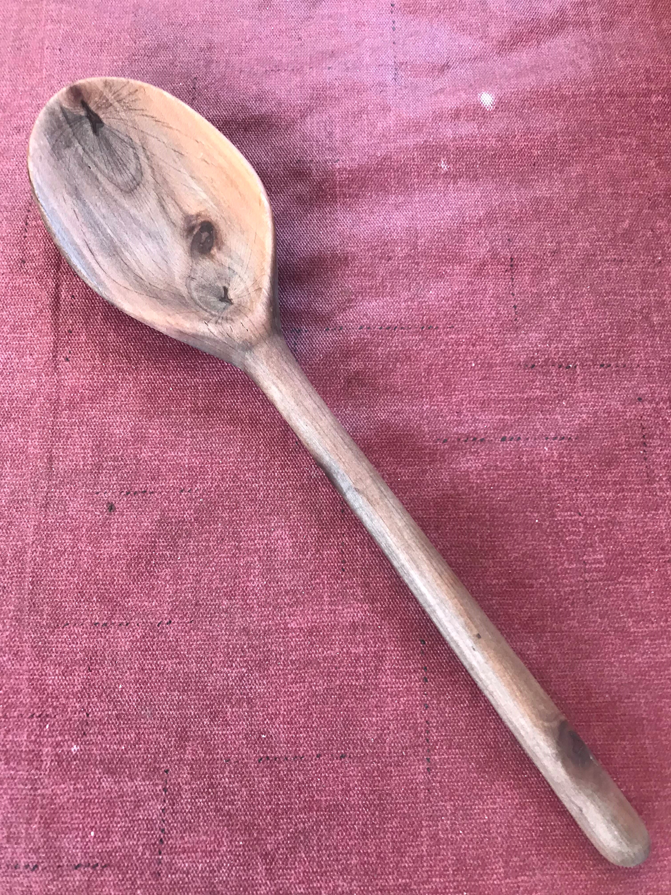  

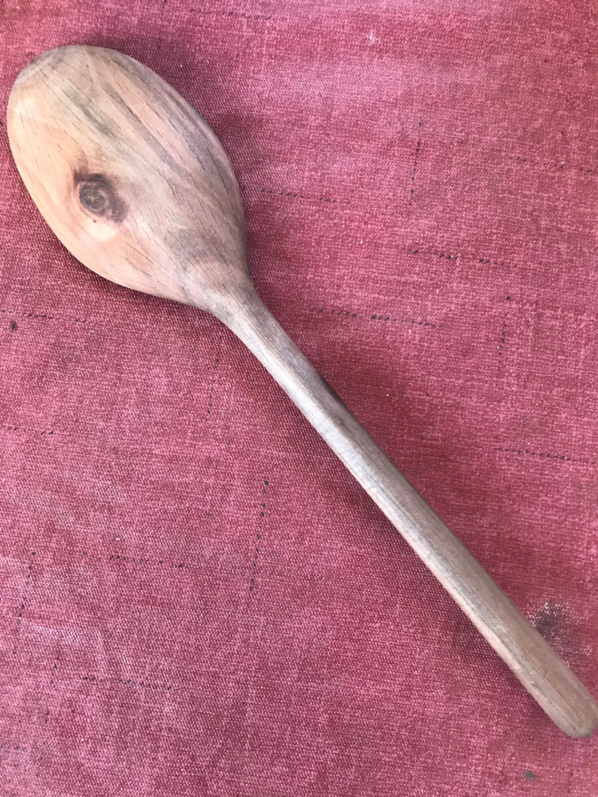  

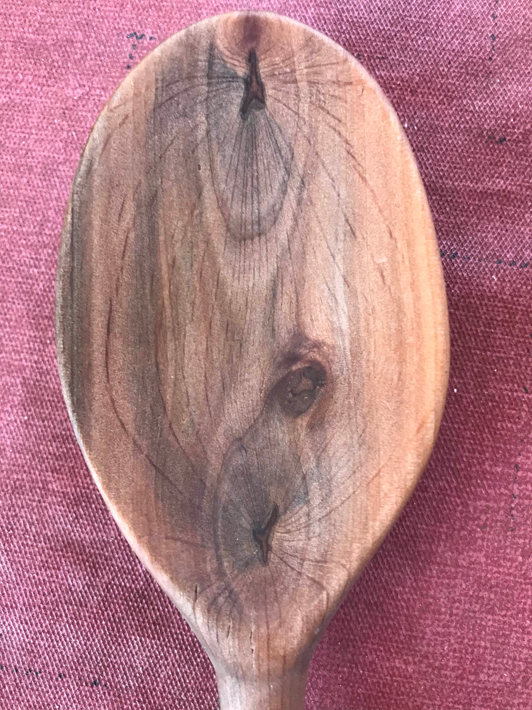  

Take from a young white alder that died after many years fighting against drought. It is a decendent of a huge white alder that used to stand in our backyard 50 years ago. That tree was called George, this tree we called George Jr. Jr.(yes Jr. x2) I think it is interesting that the pattern on the front of the spoon looks like anaphase in mitosis due to the concave nature of the scoop of the spoon.  

__________  

### Eucalyptus-Pepperwood Ladle

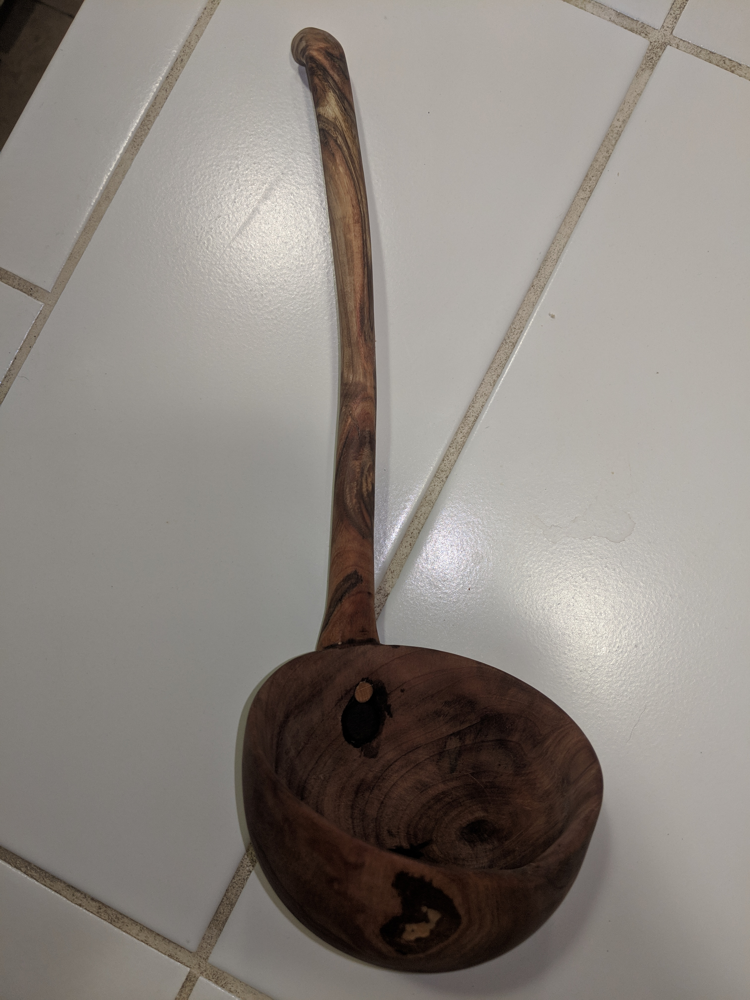  

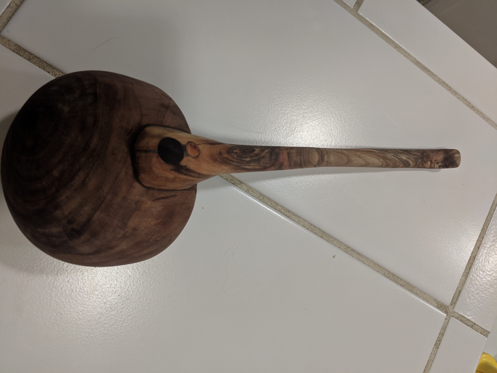  

A more complex piece. The 2 wood types are held together with dowels. It is hard to see the beautiful grain in the photos because the wood is so dark but the circular bowl portion reveals the grain of the pepperwood in a pleasing way to the eye.

__________  

__________  

__________  

__________  

Thomas Matthew 2018