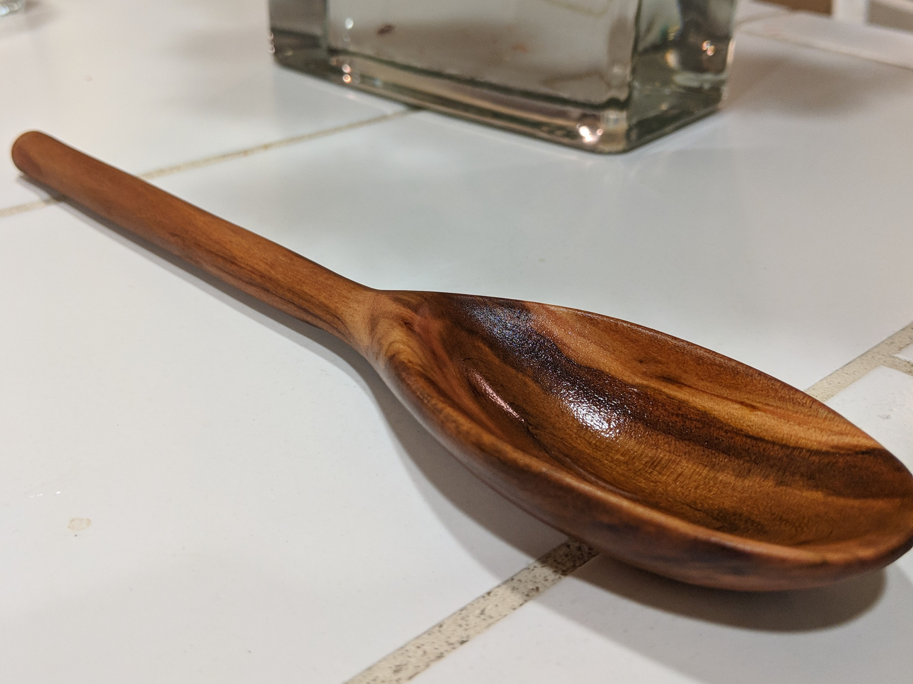
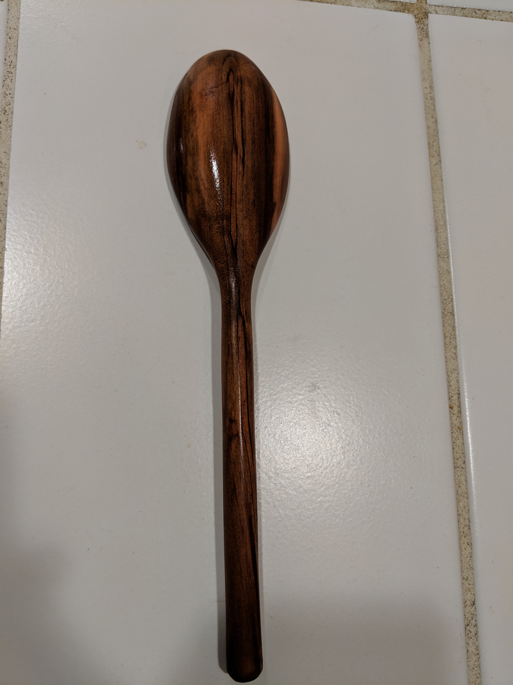
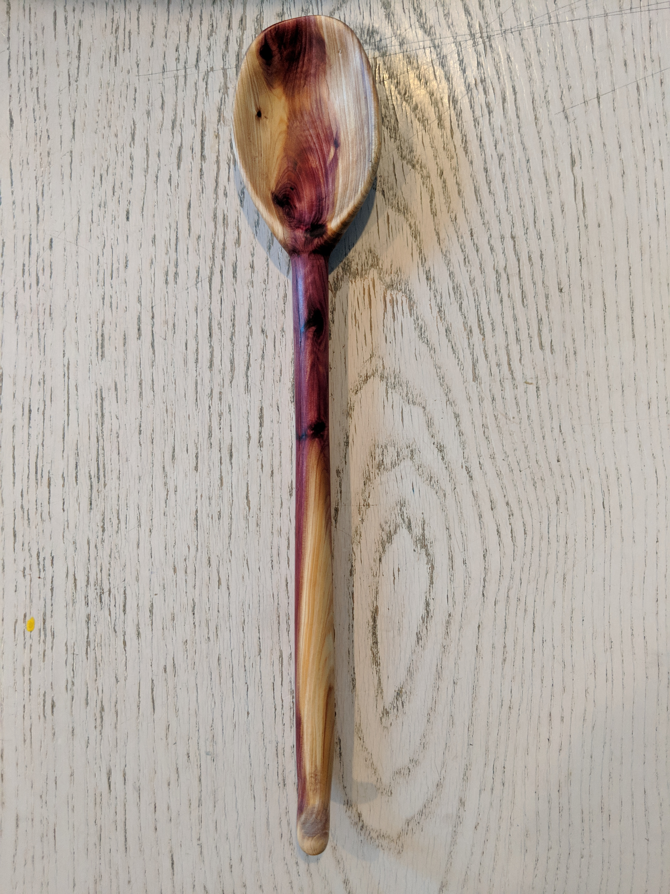
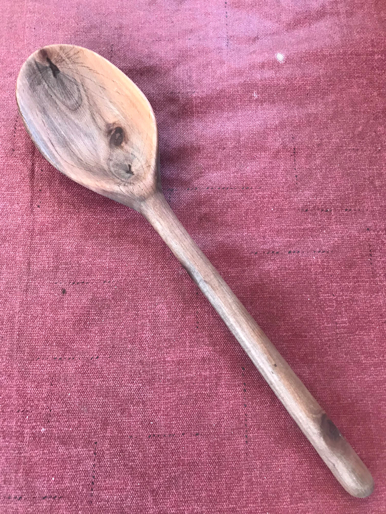
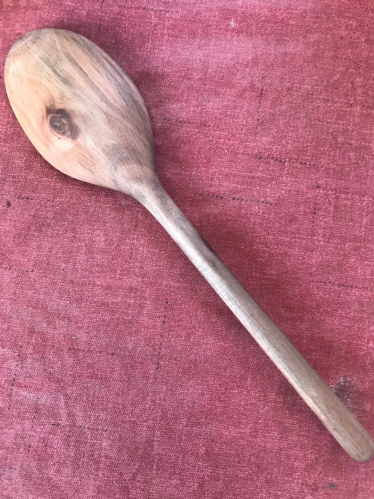
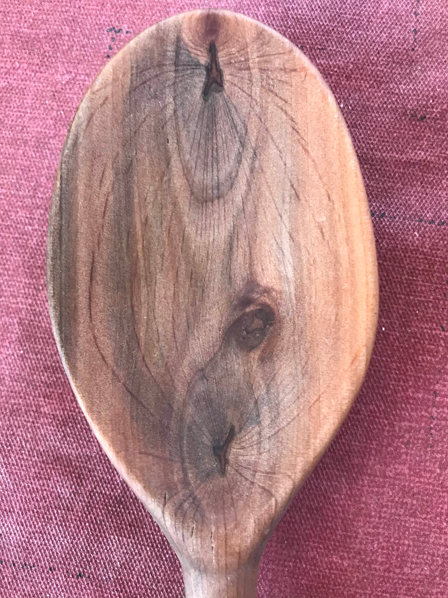

# Spoons

Handcrafted using a lathe, carving, and a lot of sanding. Wood used for spoons is all locally sourced. Below are the general steps to constructing most spoons but each project is slightly different.  

[Return Home](index.md)

### Scooping
  

The wood has been rounded into a the shape of a maraca(although not hollow) and is adequately smooth at this point.  
  

The maraca blank is cut to resemble a spoon more than a maraca.  
  
The scoop of the spoon is carved out using a hook knife.  

Once the scoop is scooped, its time to sand the spoon smooth. I won't include any photos of that because it is almost impossible to see the texture on camera. 

### Bending
The best spoons are bent to give them a more natural feel. Every utensil has a small bend, which makes a bigger difference than you would expect. Spoons that are completely straight feel completely foreign in the hand. However, most spoons for cooking are straight so this step isn't a must.  
  
This strange contraption boils water. The steam rises up and heats the fibers in the wood of the spoon.  

  
Once the fibers of the wood are heated and able to move past each other the spoon is bent in a vice. It must be held in this shape until the heated fibers fully dry which usually takes about 1-2 days.  

  
The finished product is permenetly bent. With a little recoil, the shape the spoon was in the vice remains. The more the fibers were originally heated the less recoil occurs.

## Finished Spoons

Here is a sampling of some of my best spoons. All the wood is taken from around the house and none is outsourced. The spoons are initially sanded down to 200 grit with regular sandpaper, then I use micro mesh sanders to polish the wood. Snow River Products' Wood Oil is used to lacor. Which is then covered in Briwax for a protected smooth finish. 

*All grain patterns and coloring are completely natural, no dye is used in this process.*

### Pepperwood Spoon

This spoon was given as a gift to a very good friend of mine on her birthday. This was my first spoon that I was really proud to show off for the craftsmanship. It is best used making pasta.

### Magnolia Spoon

This scrap magnolia piece revealed a beautiful grain. The spoon is bent at the connection between the scoop and the handle. Additionally, this spoon has a loop at the end, which functions aesthetically and for ease of storage. The exposed bark on the side of the scoop is not a mistake, rather it gives the spoon character.

### Spoon - Unknown Wood
  

Turned from a quality piece of wood lieing around, this spoon is slightly bent where the handle meets the scoop. Possibly due to the wood's inherent hardness, this spoon is sanded very smooth. I don't know the origin of this wood. Short, with a wide, bent scoop this spoon is ideal as a eating utensil, not a cooking one like many of the others.

### Mother's Day Present - Cyprus Spoon

This spoon is made from an old dead cyprus that Mother planted that was taken from a seed of a tree my grandparents planted. I wanted to give her a spoon that captured something special to her. I also wanted to show my appreciation with a present she could use and one that would make her happy everytime she looked at it. The grain turned out to be the most beautiful out of any of the spoons I have made, displaying a fiery purple core that winds throughout the spoon. 

### White Alder Spoon 

Take from a young white alder that died after many years fighting against drought. It is a decendent of a huge white alder that used to stand in our backyard 50 years ago. That tree was called George, this tree we called George Jr. Jr. I think it is interesting that the pattern on the front of the spoon looks like a stage in mitosis.