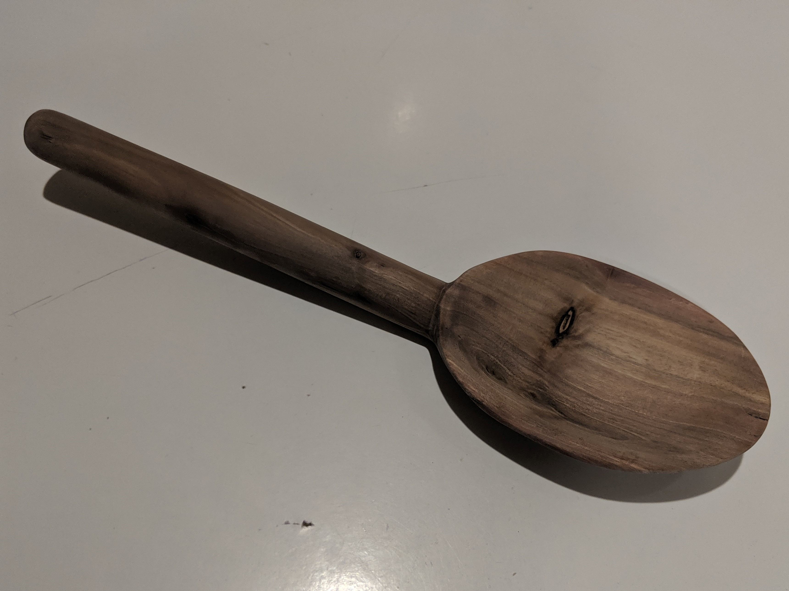
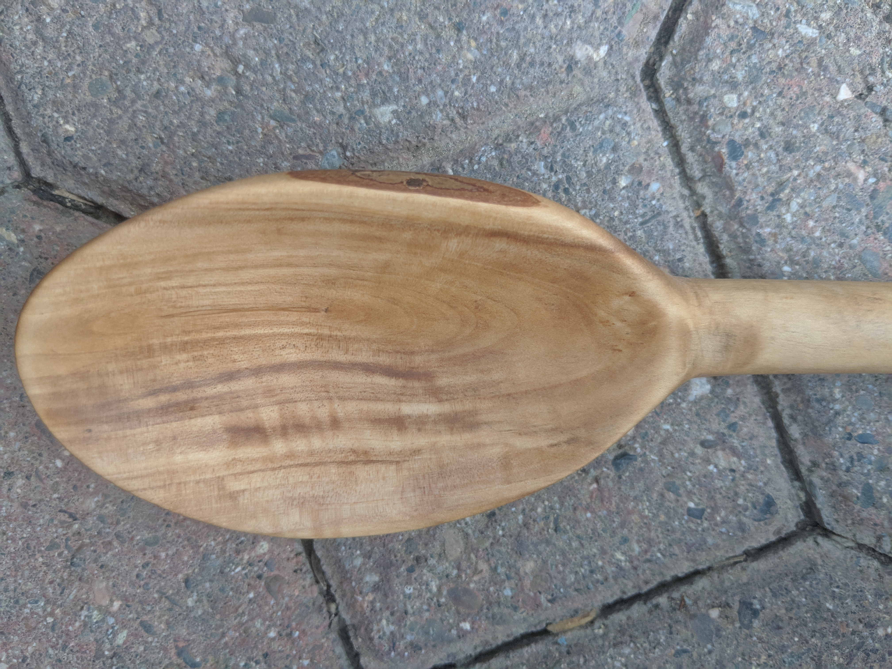
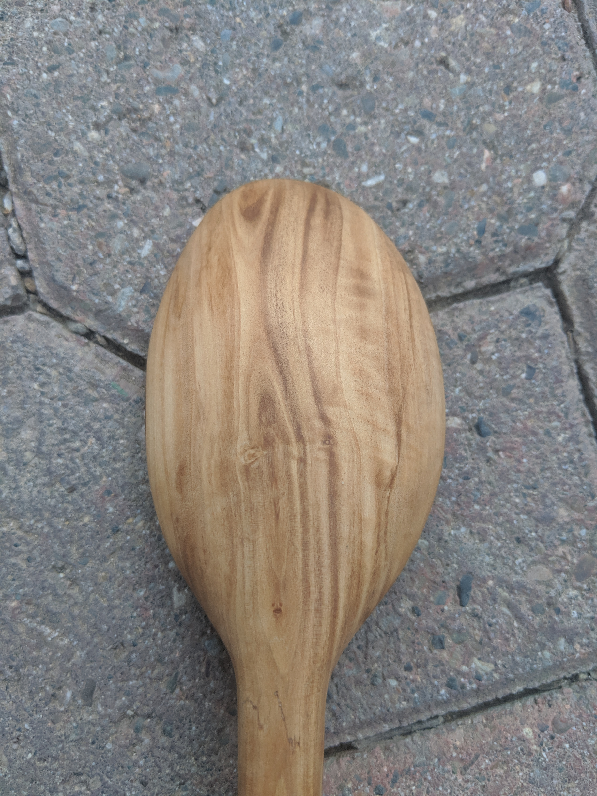

# Thomas Woodworking Co.
[link example](example.md)
## Crafted from Raw Wood
Dead trees are given new life and beauty through these projects. As projects usually don't require large amounts of wood, most wood is sourced from my backyard.  Here are photos showing various types of trees and their respective grain coloring:  

### Cyprus

   

### Eucalyptus

   

# Spoons
Handcrafted using a lathe rather than carved. Below are the general steps to constructing most spoons but each project is slightly different.  

### Scooping
  

The wood has been rounded into a the shape of a maraca(although not hollow) and is adequately smooth at this point.  
  

The maraca blank is cut to resemble a spoon more than a maraca.  
  
The scoop of the spoon is carved out using a hook knife.  

### Bending
The best spoons are bent to give them a more natural feel. Every utensil has a small bend, which makes a bigger difference than you would expect. Spoons that are completely straight feel completely foreign in the hand. However, most spoons for cooking are straight so this step isn't a must.  
  
  

## Finished Spoons
  

Turned from a quality piece of pepper wood, this spoon is slightly bent where the handle meets the scoop. Possibly due to the woods inherent hardness, this spoon is sanded very smooth.  

This scrap magnolia piece revealed a beautiful grain. The spoon is bent at the connection between the scoop and the handle at a sharper angle than the pepper wood spoon. Additionally, this spoon has a loop at the end, either to wrap a string through or for ease of storage. The exposed bark on the side of the scoop is not a mistake, rather it gives the spoon character.
