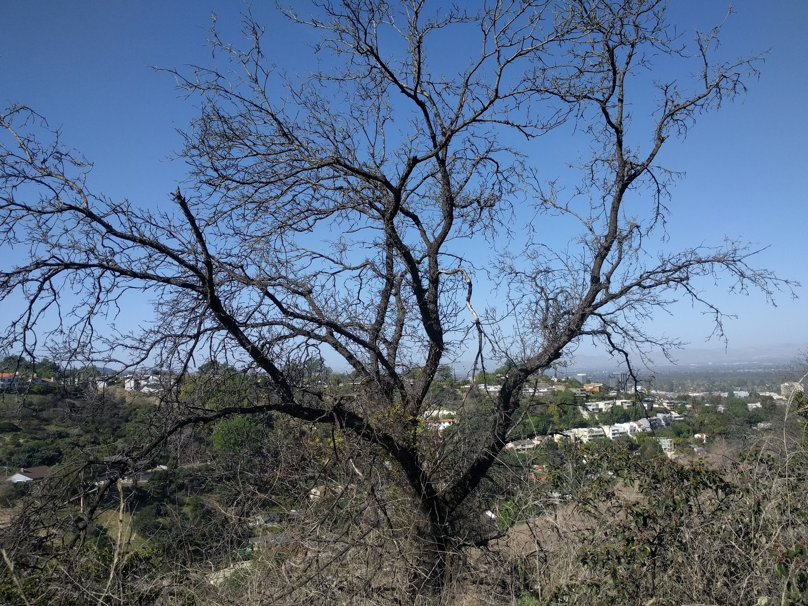
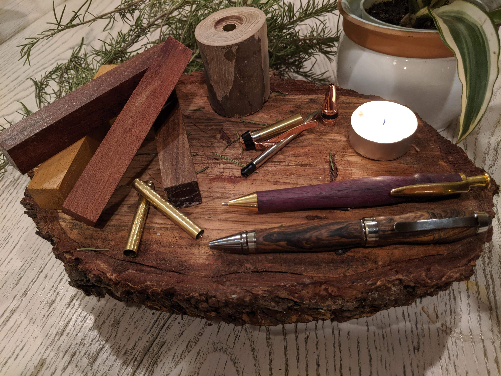
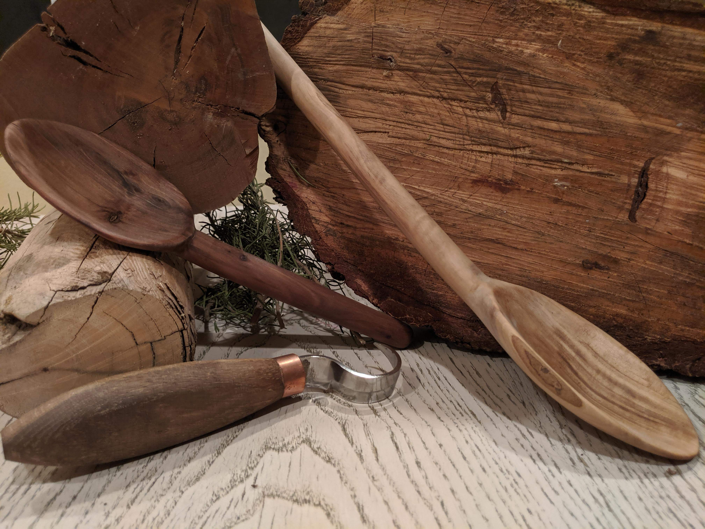
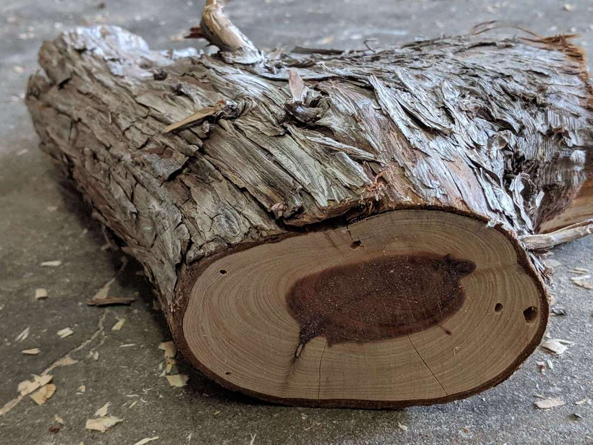
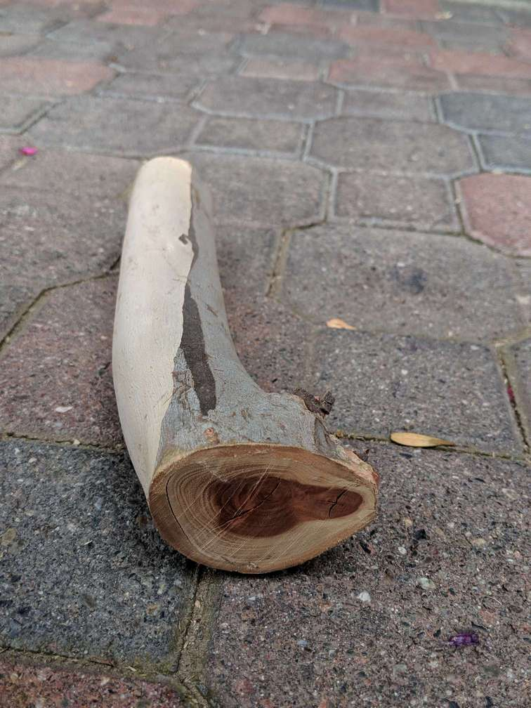
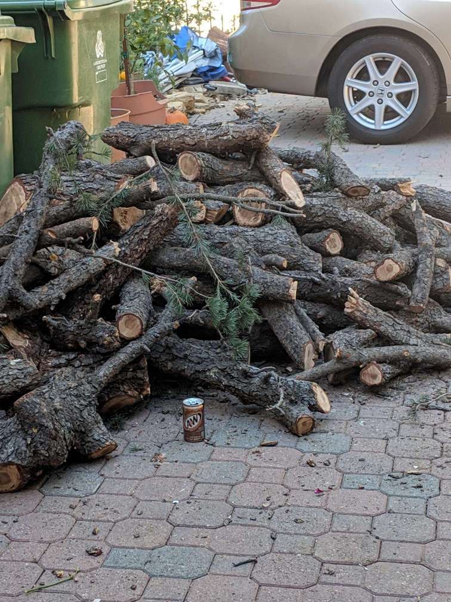
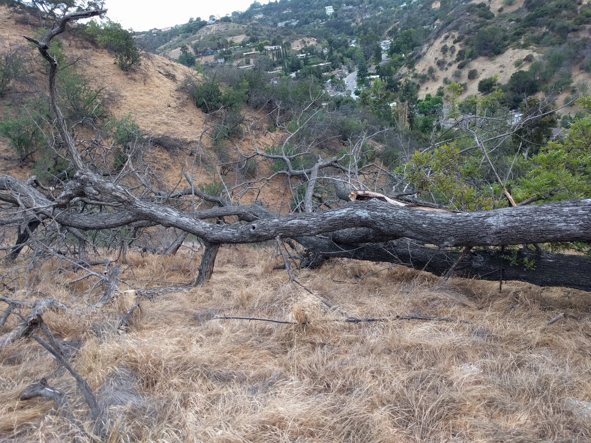

| About |
| :---: |  
|  |  
  
  
Thomas Woodworking Co is a home shop based out of Los Angeles, California. All pieces are handcrafted personally with the greatest attention to detail. Local dead trees, many of which died in California's recent severe drought, are used in most projects.   

| [Contact Me](Contact.md) |
| :---: |  
|  |  

___________ 

# Completed Work:
___________

## Pens 

[View Pens](Pens.md)

## Spoons

[View Spoons](Spoons.md)

## Furniture 

[View Furniture](Furniture.md)

__________
__________
__________

# Materials and Creation  
  
  

## Crafted from Local Wood

Dead trees are given new life and beauty through these projects. As pen/spoon projects don't require large amounts of wood, most wood is sourced from my backyard. Here are photos showing various types of trees I have used and their respective grain coloring:  

__________

### Cypress

Strangly enough, we have cypress trees that have purple core wood. Looking online, I could find nothing else like this.

   

### Eucalyptus

Eucalyptus trees have a beautiful orange colored core wood.

   

### Pine

Taken from a felled tree in our neighborhood (root beer can for reference).

### Walnut

Here is a walnut tree that was taken by termites. Rotting parts are left to enrich the soil while we carefully pick out small branches elevated from the ground.

## Creation

There is a unique process for creating each type of piece. Even within that process each piece has its own variation since they are all handmade. I have linked them here as well as next to their display photos under each section.  

*(Pen creation coming soon)*

[Spoon Creation](SpoonCreation.md)  

[Side Table Construction](SideTableCreation.md)  

[Go to Top](#Thomas-Woodworking-Co)

_________  

_________  

_________  

_________  

Thomas Matthew 2019
