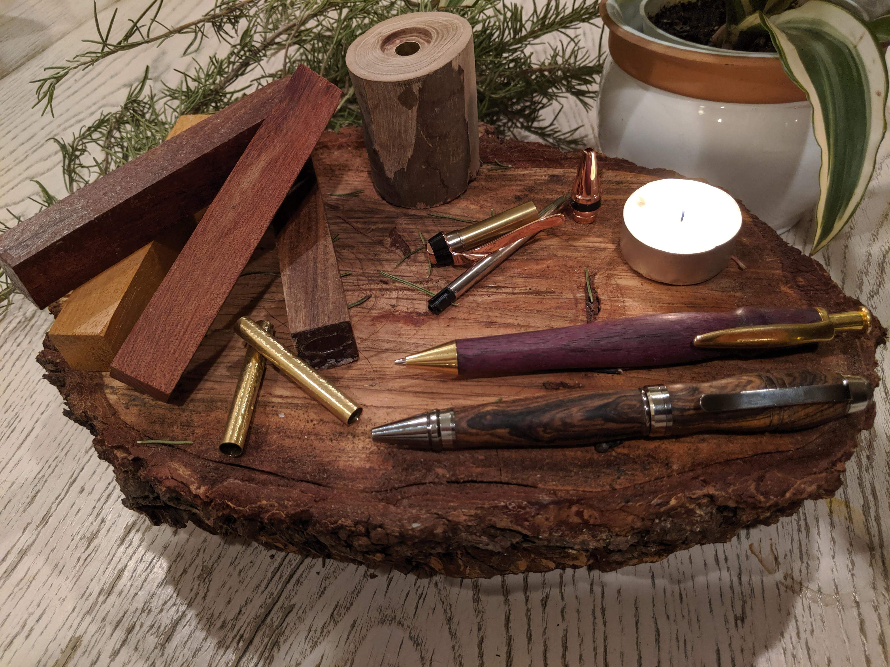
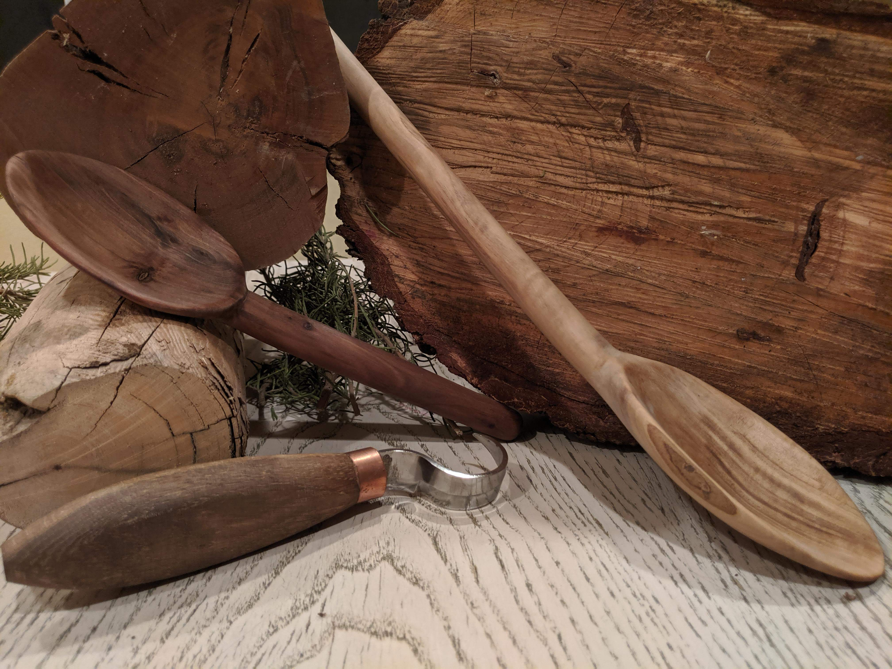

# Thomas Woodworking Co.
___________
This site is meant to display my woodworking projects. In each section, there is a "My favorite ____" for quick viewing of some of my best work.
___________
**If you purchased a pen and it contains an ID number, you can view a photo and thoughts behind making it. This information is in [Pens](Pens.md).** (Not all pens contain IDs and corresponding photos.)

# Pens 

[View Pens](Pens.md)

# Spoons

[View Spoons](Spoons.md)

# Furniture 

[View Furniture](Furniture.md)

__________
__________
__________

## Crafted from Local Wood
Dead trees are given new life and beauty through these projects. As projects usually don't require large amounts of wood, most wood is sourced from my backyard, especially wood for spoons.  Here are photos showing various types of trees I use and their respective grain coloring:  

__________

### Cyprus

Strangly enough, we have cyprus trees that have purple core wood. Looking online I could find nothing else like this.

   

### Eucalyptus

Eucalyptus trees tend to crack at the worse times, but if you can control them they have a beautiful orange colored core wood.

   

### Pine

Taken from a felled tree in our neighborhood, root beer can for reference.

[Go to Top](#Thomas-Woodworking-Co)
