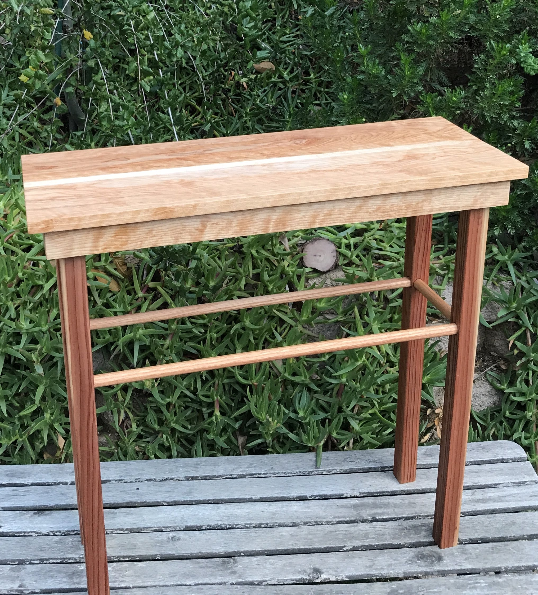

## Thomas Woodworking Co.  

| About |
| :---: |  
|  |  
  
  
Thomas Woodworking Co is a home shop based out of Los Angeles, California. I am a young woodworker using my eye for style in each of my pieces. All pieces are handcrafted personally with the greatest attention to detail. My best works have transformed dead trees with a story to tell around my neighborhood into beautiful, functional art pieces. In each section, my favorite piece is linked to at the top.  

___________
**If you purchased a pen and it contains an ID number, you can view a photo and thoughts behind making it. This information is in [Pens](Pens.md).**   
(Not all pens contain IDs and corresponding photos.)  

___________
# Pens 

[View Pens](Pens.md)

# Spoons

[View Spoons](Spoons.md)

# Furniture 

[View Furniture](Furniture.md)

__________
__________
__________

## Crafted from Local Wood
Dead trees are given new life and beauty through these projects. As pen/spoon projects don't require large amounts of wood, most wood is sourced from my backyard. Here are photos showing various types of trees I have used and their respective grain coloring:  

__________

### Cypress

Strangly enough, we have cypress trees that have purple core wood. Looking online, I could find nothing else like this.

   

### Eucalyptus

Eucalyptus trees have a beautiful orange colored core wood.

   

### Pine

Taken from a felled tree in our neighborhood (root beer can for reference).

[Go to Top](#Thomas-Woodworking-Co)

_________  

_________  

_________  

_________  

Thomas Matthew 2019
