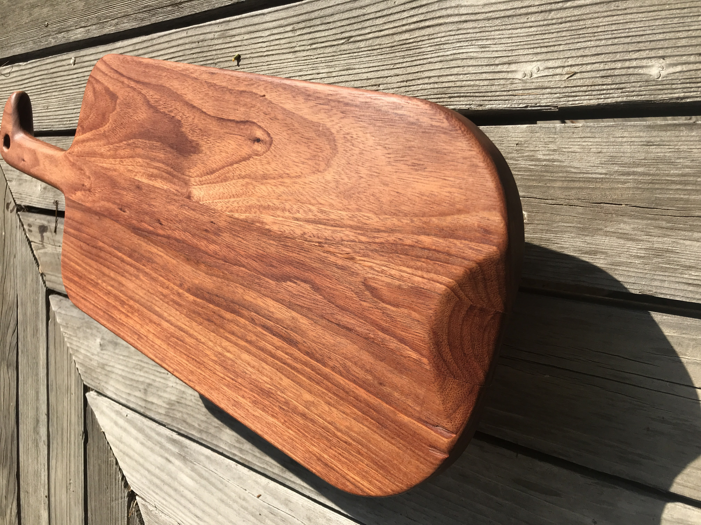

# Latest Projects 

______________ 

[Return Home](index.md) 

______________ 

## Padauk Wood Cheese/Bread Board: OCT 2020 

 

 

 

Small divit made to make picking up the board easier.

 

Wood is noticebly different looking when facing from different directions in the same light. Likely because padauk wood is known for numerous pores.
Loop in the handle made for hanging up when not in use by a leather cord or rope. Handle shape meant to cradle a right handed person.

### Construction

 

Starting with a thick piece of Paduak wood(approx 2in), first cuts were made for the sides of the board and then the spine. These thicker pieces were cut to a thickness of about 3/4-1in.

 

The short cut for the handle was made with the handsaw. It made me appreciation the woods strength and gratitude to the tablesaw!

 

Large amounts of material were cut off with the handsaw. The angle grider was used to smooth out the rough cuts and do final adjustments to the arc. 

 

Shape was mirrored and carving was ready to be made at this point(before glueing). 

 

Carving was made using both a drill and hand chisel. As shown, the drill helped remove some intial material near the edge. The chisel brought the edge accurately to the line. This process was time consuming but relaxing. The blue color seen in the final images was achieved by mixing the resin with ordinary blue watercolor paint. This idea was taken from Peter Brown's Dye Trying YouTube series. It worked quite well! 

 

Here is the 'final' step: glueing all the pieces together. This is actually just the first half of construction. Most of the time is spend sanding and finishing: The resin was sanded down using 220 grit and brought back up to a polish with micro mesh sanders(approx 10000+). The handle was shaped to fit with the file and sandpaper. Burns, notches, or other blemishes that appeared from inital shaping and construction must be sanded away. Small differences in height between the three pieces were sanded flat. The whole piece was sanded up to 220 grit. 

_______________ 

_______________ 

_______________ 

Thomas Matthew 2020
