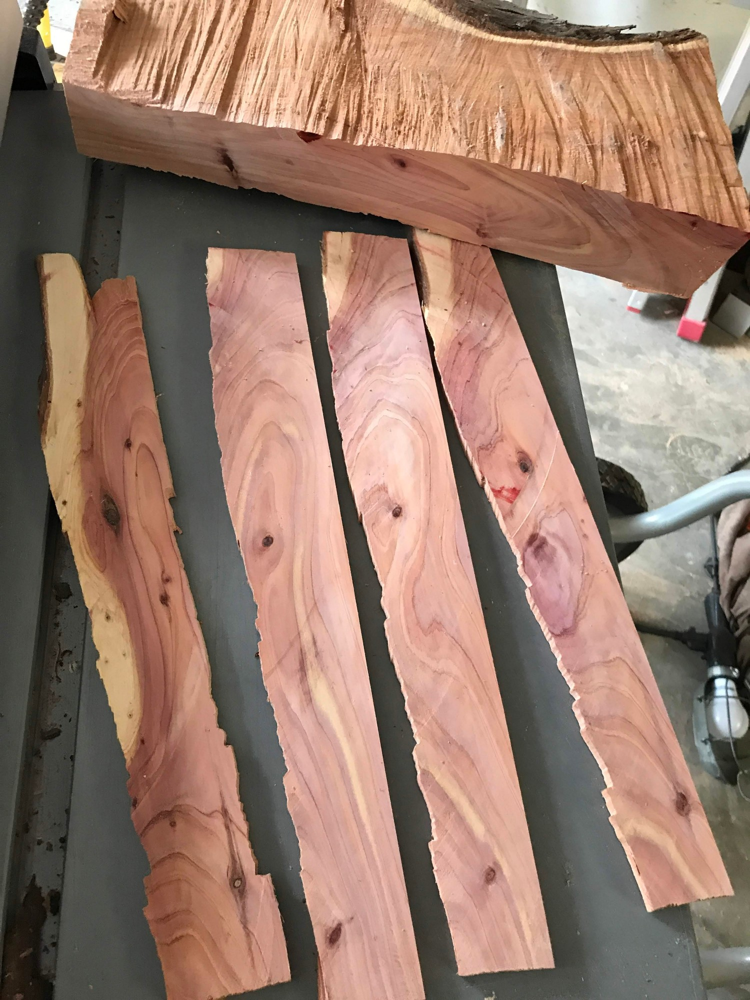
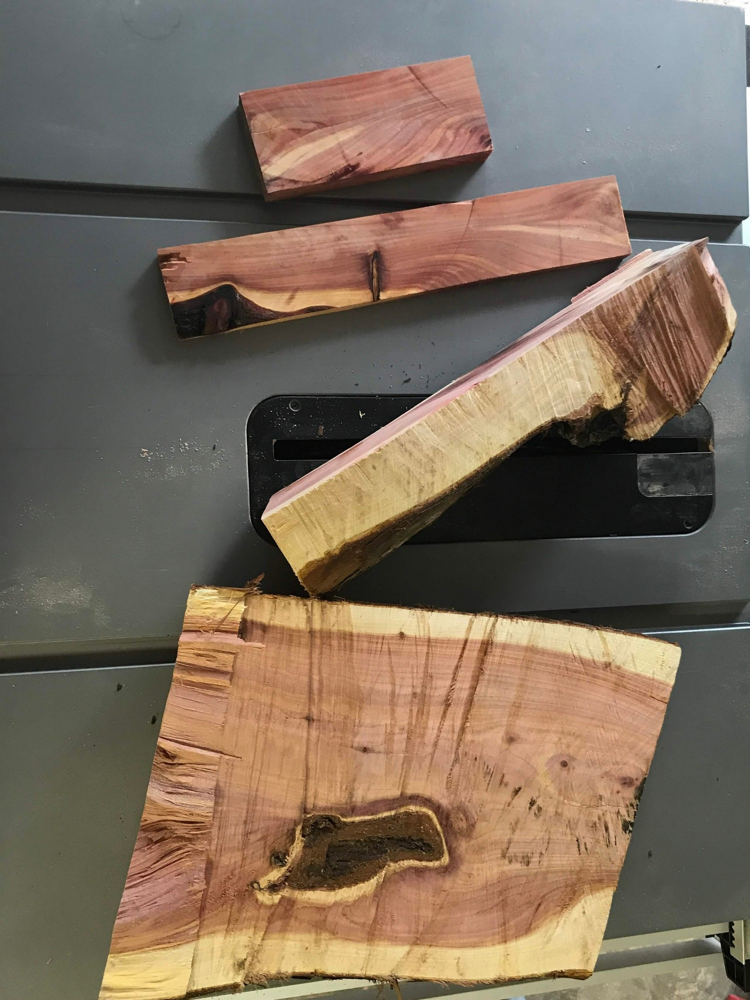
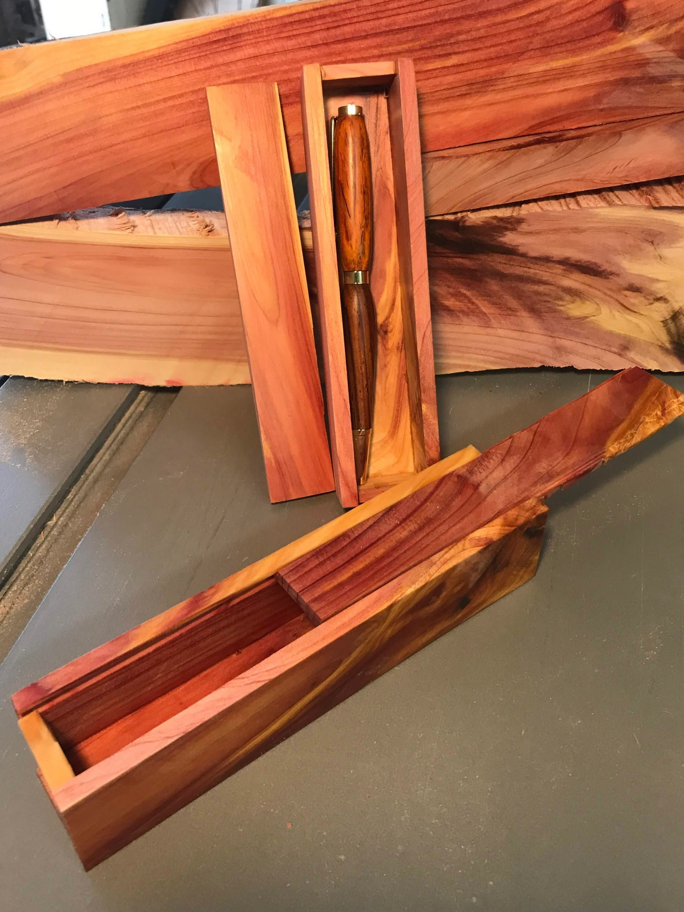

## Pen Box Prototypes

This section shows my progression towards a simple, easy to make box to hold individual pens. Both the quality of the box and its built time are important as I want to spend most of my time making the pen inside the box.  

I picked up some great pieces of cyprus stump on my way home from school. Somebody apparently had cut their tree down and had extra pieces.  

### 3/13/2020:
Here I take a chainsaw cut off through the tablesaw to make 1/8in thick pieces. 

  

The process of refining the wood from stump to board:  

  

My first 2 prototypes. The first one, shown flat on the table has a lid that slides in and out on groves cut into the box. The second one the lid just fits on top as I wanted to get the measurements right as minute differences mess up the function of the sliding lid.  

  

