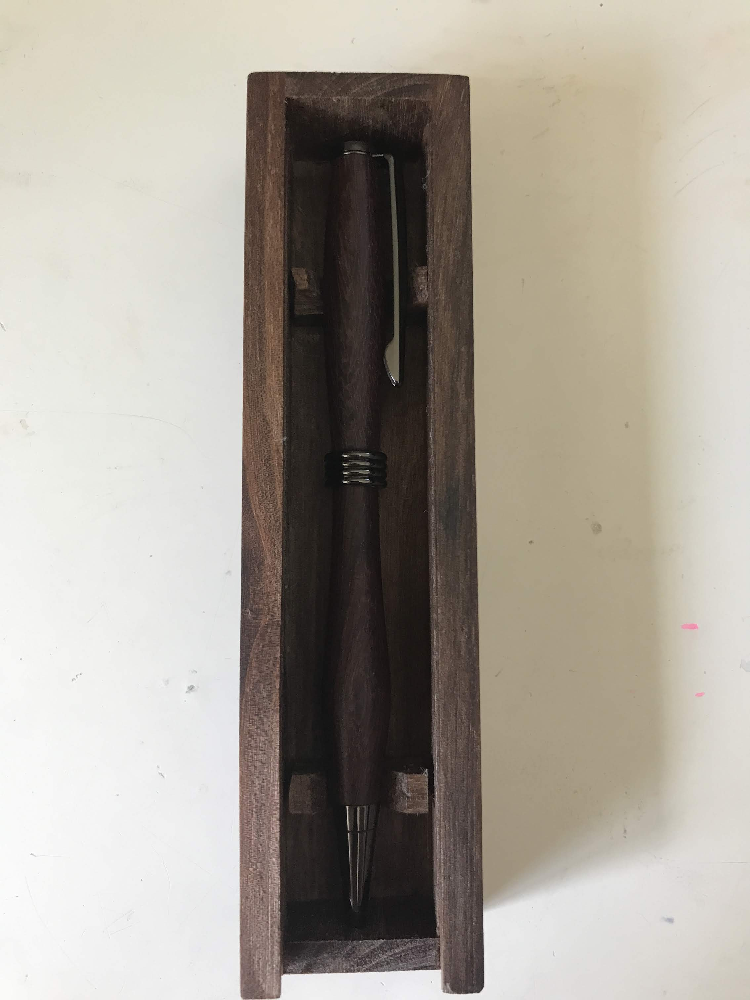
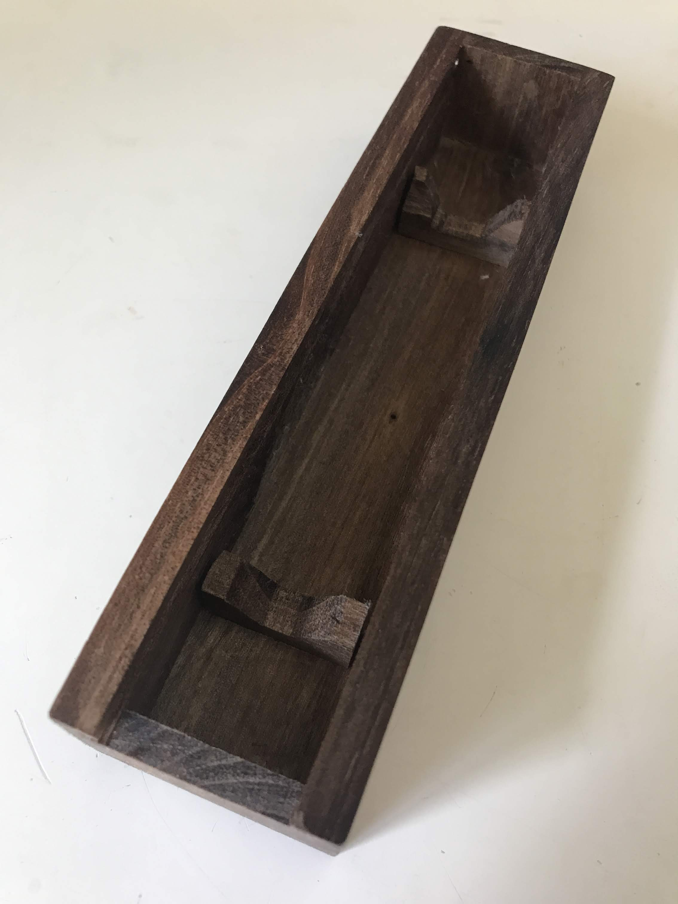

## Pen Box Prototypes

This section shows my progression towards a simple, easy to make box to hold individual pens. Both the quality of the box and its built time are important as I want to spend most of my time making the pen inside the box.  

I picked up some great pieces of cyprus stump on my way home from school. Somebody apparently had cut their tree down and had extra pieces.  

### 3/13/2020:
Here I take a chainsaw cut off through the tablesaw to make 1/8in thick pieces. 

  

The process of refining the wood from log to board:  

  

My first 2 prototypes. The first one, shown flat on the table has a lid that slides in and out on groves cut into the box. The second one the lid just fits on top as I wanted to get the measurements right as minute differences mess up the function of the sliding lid.  

  

### 3/20/2020:

I made 2 more boxes, based on the plans developed before from two different woods shown after being made into planks below.

  

  

  

The second part of the box, and one of the more subtle but important pieces, is the mechanism to hold the pen snugly in the box. While the pen must not rattle, it also must be easily taken out for use. I tried two different ways.  

  

  

  

The mechanism on the walnut box that cradles the pen works much better and is what I will be using.  

### 3/25/2020: 

A magnet, one placed on the lid and one on the box, helps keep the lid on the box. It also gives the box a nice click when it closes.

